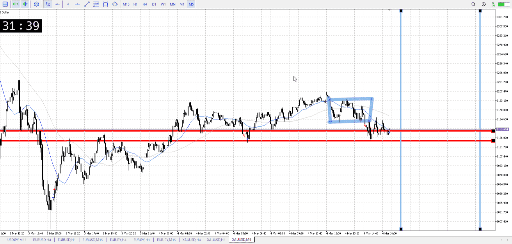

<画像>

`INPUT[inlineSelect(option(Range), option(Trend)):type]`

ルールに沿っていた
```meta-bind
INPUT[toggle:rule]
```

勝った
```meta-bind
INPUT[toggle:OK]
```

良くないパターン

青四角レンジを抜いたところを売り、としたかった

まずレンジとして移動平均が絡まってない、横幅なさすぎる
次に15mの買い、近すぎる
    張り付いてたら話は別
取引した時間、遅すぎる

レンジとして横幅取れ
5mで入るなら入るで、一つ上の時間足である15mの場の確認をする
深夜過ぎたら一層警戒