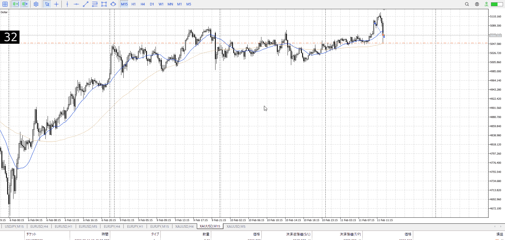
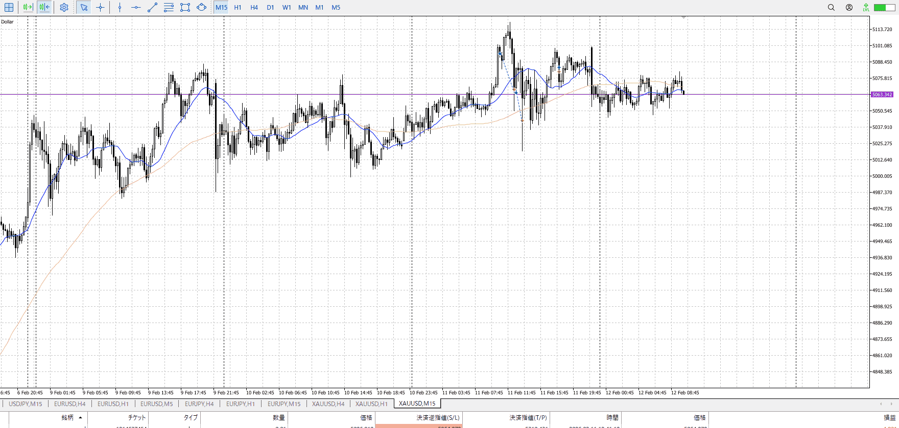

TPSL
```meta-bind
INPUT[toggle:TPSL]
```

Height
```meta-bind
INPUT[toggle:Height]
```
Width
```meta-bind
INPUT[toggle:Width]
```

Direction
```meta-bind
INPUT[toggle:Direction]
```
Incline_Ratio
```meta-bind
INPUT[toggle:Incline_Ratio]
```

良さげではあったけど、一気に落ちてきた
損切がはやい、ここエントリーポイントだろ

エントリーがよかった・タイミング
 - 高さがよかった
 - 横軸が良かった
分析がよかった
 - 上位足で方向取れてる
 - 1hで戦略立ててる
 - 傾き比率とってる
 - 切り上げ切り下げ
 - 推進調整

そのそれぞれで、予想してる利確損切までやった場合の結果
これを集める


t
そもそも売りが失敗したという想定でやっていて、落ちてくるのが早いので怪しい
また入るのが早すぎて損切点が分からなくなってる、本来ならその15分後の下髭出た瞬間程度で、下髭損切でいい

これが損切するからこそ、次はどうなるかを見る
そもそも指標前でもあるし

指標前に入ってはいけないのは、動かないから
指標前で動いたから入ったが、それで損切するならどの道待ち



この後も上の方でレンジしてるが、そこでは入れない
想定が何もないので
