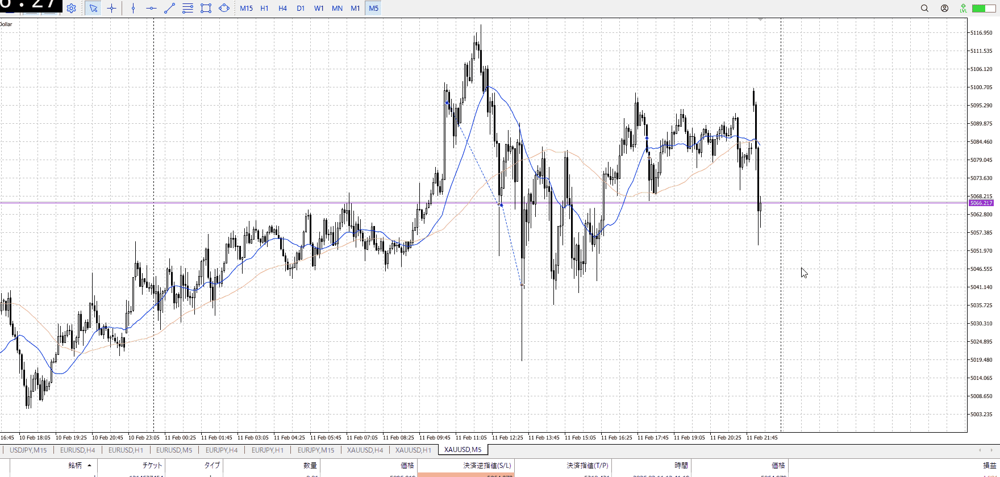

<画像>

TPSL
```meta-bind
INPUT[toggle:TPSL]
```

Height
```meta-bind
INPUT[toggle:Height]
```
Width
```meta-bind
INPUT[toggle:Width]
```

Direction
```meta-bind
INPUT[toggle:Direction]
```
Incline_Ratio
```meta-bind
INPUT[toggle:Incline_Ratio]
```

シンプルに深夜すぎる。

エントリーがよかった・タイミング
 - 高さがよかった
 - 横軸が良かった
分析がよかった
 - 上位足で方向取れてる
 - 1hで戦略立ててる
 - 傾き比率とってる
 - 切り上げ切り下げ
 - 推進調整

そのそれぞれで、予想してる利確損切までやった場合の結果
これを集める