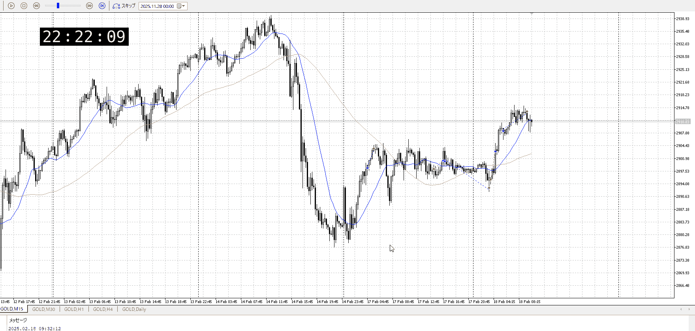

<画像>

TPSL
```meta-bind
INPUT[toggle:TPSL]
```

Height
```meta-bind
INPUT[toggle:Height]
```
Width
```meta-bind
INPUT[toggle:Width]
```

Direction
```meta-bind
INPUT[toggle:Direction]
```
Incline_Ratio
```meta-bind
INPUT[toggle:Incline_Ratio]
```

伸びに対して落ちを見ずに入っている
一応5m下髭だけ見たけど、これで決まるわけではなし
15m下髭から入りたいところ

あとビビッて切ってるけど上まで取れ

> [!note]
> 遅い。ここから入るくらいなら後のやつだけにするか、一つ前のやつの損切地点で入る。
> 一つ前の損切地点は下に振ってから大きく陽線を出しており
> 上に抜ける典型例

