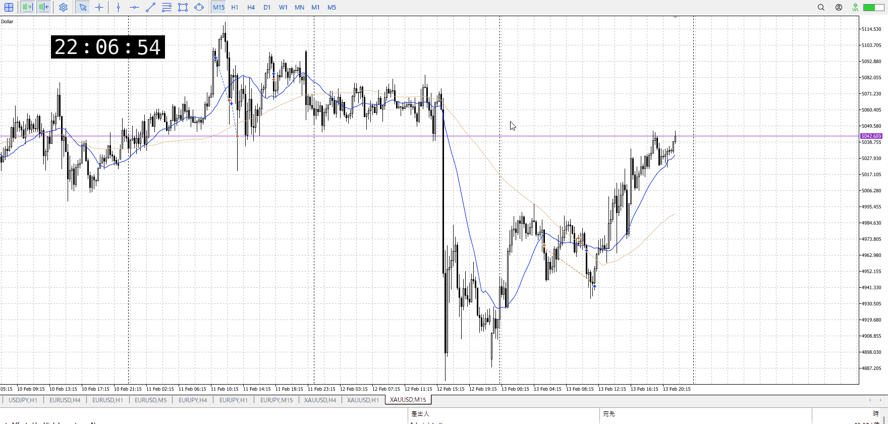

<画像>

TPSL
```meta-bind
INPUT[toggle:TPSL]
```

Height
```meta-bind
INPUT[toggle:Height]
```
Width
```meta-bind
INPUT[toggle:Width]
```

Direction
```meta-bind
INPUT[toggle:Direction]
```
Incline_Ratio
```meta-bind
INPUT[toggle:Incline_Ratio]
```

いろいろ良かったが、早かった
下降に対して上昇を見て戻り売り、にしては上昇の勢いに対して転換用の溜めが少ない

早かったのは間違いない
そのうえで當側、後の方で入るのが正解かというとその限りでない
レンジの崩れを狙ったものだが、レンジは見づらくそもそも指標前

最初の早い奴を見送り、レンジ崩れまで待っても分かりにくいので入らないという手が手堅いもの

早い奴を見送り、レンジ崩れで入る場合のプロセス
まず早い方はレンジが小さく、直で自分が売ったところから落ちる場合、急落すぎるので見送り

その後横幅を上昇と同じくらい取りしっかり受け止め
落ちに対して上昇かけたが、上がり切らない->受け止め
からの上髭で入る

利確は指標前なので早め、一番最初に引っかかる直近安値で下髭揃い始めたので利確