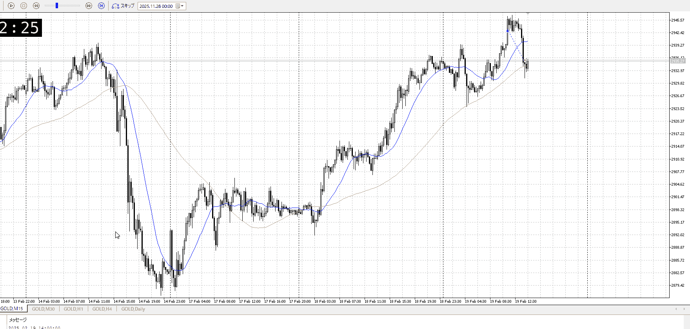

<画像>

TPSL
```meta-bind
INPUT[toggle:TPSL]
```

Height
```meta-bind
INPUT[toggle:Height]
```
Width
```meta-bind
INPUT[toggle:Width]
```

Direction
```meta-bind
INPUT[toggle:Direction]
```
Incline_Ratio
```meta-bind
INPUT[toggle:Incline_Ratio]
```

確定を待ってないし、確定的に抜けたような足でもない
抜けにしては重く、そもそも1huなので抜けより押しを待ちたい

一本の待ち、足の形状、その後の遅さや押し待ちなど
まず横幅を待って押しを取りたかったところ

