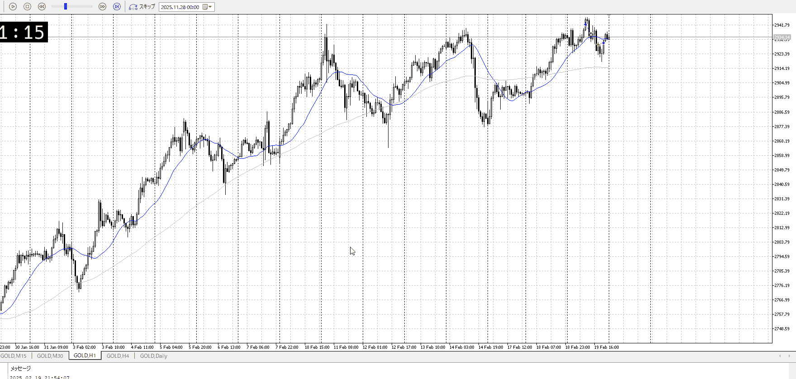
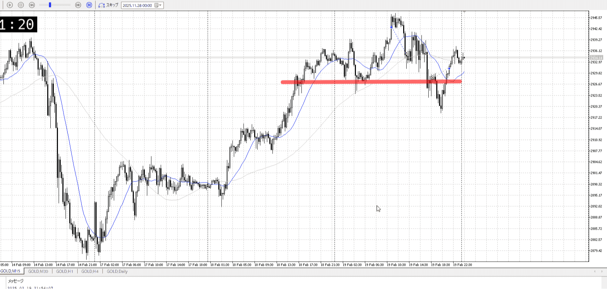

<画像>

TPSL
```meta-bind
INPUT[toggle:TPSL]
```

Height
```meta-bind
INPUT[toggle:Height]
```
Width
```meta-bind
INPUT[toggle:Width]
```

Direction
```meta-bind
INPUT[toggle:Direction]
```
Incline_Ratio
```meta-bind
INPUT[toggle:Incline_Ratio]
```

上昇に対して、反転を狙う
気になるであろう高さを確定的に抜けてないのに売ってる、早い

抜いた後オーバーシュートで戻ってきた奴への対応は、後々
1hでしっかり登ってきてる奴に15mで気になる部分も抜かないうちに入るのは早すぎ、何で入るか明確に