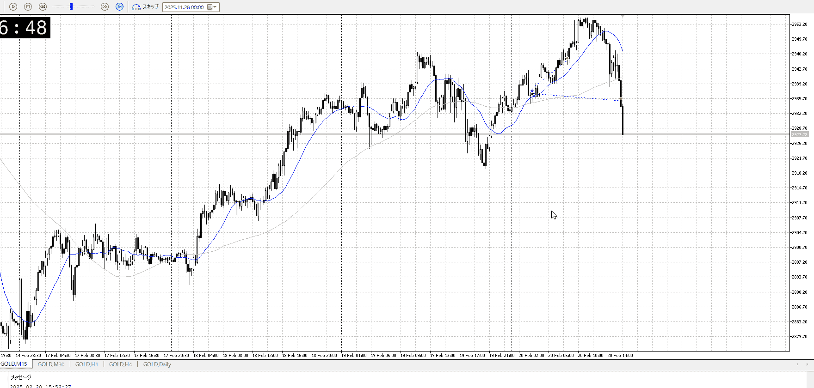
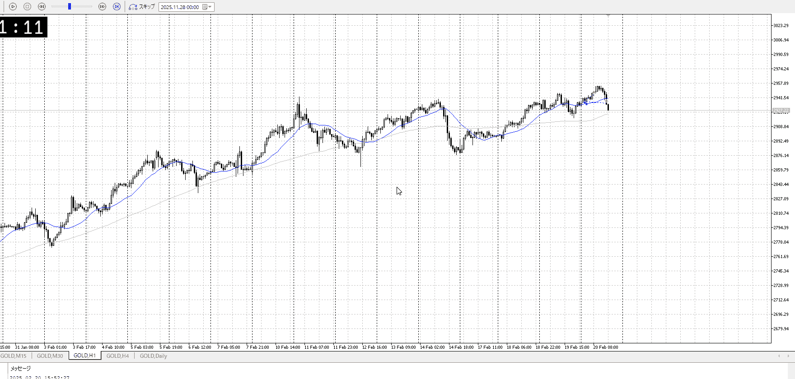

<画像>

TPSL
```meta-bind
INPUT[toggle:TPSL]
```

Height
```meta-bind
INPUT[toggle:Height]
```
Width
```meta-bind
INPUT[toggle:Width]
```

Direction
```meta-bind
INPUT[toggle:Direction]
```
Incline_Ratio
```meta-bind
INPUT[toggle:Incline_Ratio]
```

4h1hに従って、15mの売り崩れを狙った、5mの買い
5mの買いなので直近高値でも妥当、その後は追加
5mの買いなら5mらしく上でレンジ抜けた時点で無理では

1hレンジの上での押し目買いを考えたい場合

それなら普通に一旦切って、また別に押し目でレンジなり作った後を狙えばいい
どっちみち元々5m、事前に何で入ってるのか把握していれば上で切れたはず

伸びた後上髭付けて、ここで抜けずにとどまった
そしてとどまりを下に勢いよく抜けた、売り
妥当な天井での止まりと売り、一旦切って様子見したい