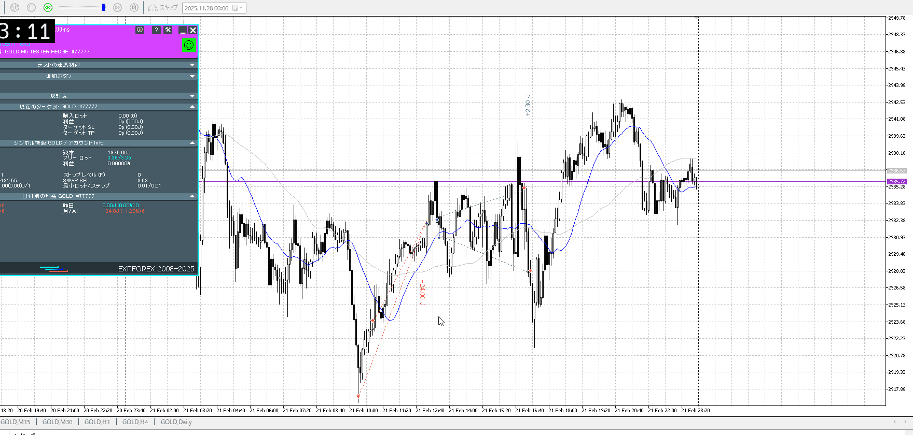
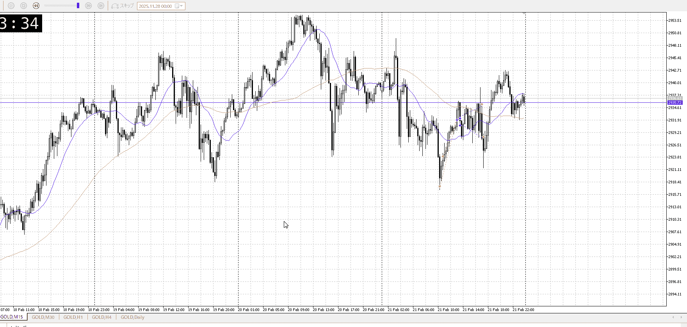

<画像>

TPSL
```meta-bind
INPUT[toggle:TPSL]
```

Height
```meta-bind
INPUT[toggle:Height]
```
Width
```meta-bind
INPUT[toggle:Width]
```

Direction
```meta-bind
INPUT[toggle:Direction]
```
Incline_Ratio
```meta-bind
INPUT[toggle:Incline_Ratio]
```

まず、15mは抜いたが1hは抜いてない
この時点で15m入り、1hに沿ってないので1hレンジ下が精々

速攻で入ってもかなり損切を持つことになる
入らないのが吉

二つ目の戻り売りしようとしてる方も、1hで返してるんだからもう少し様子見が必要

