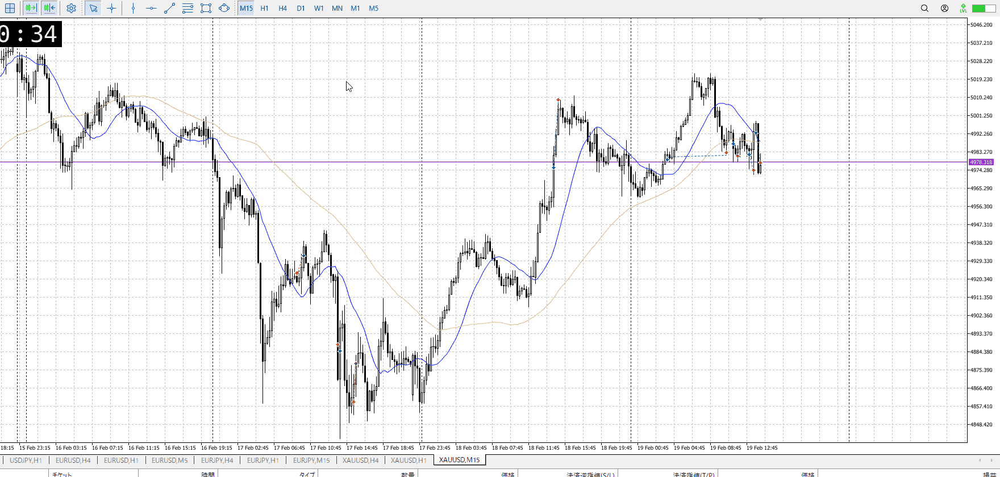
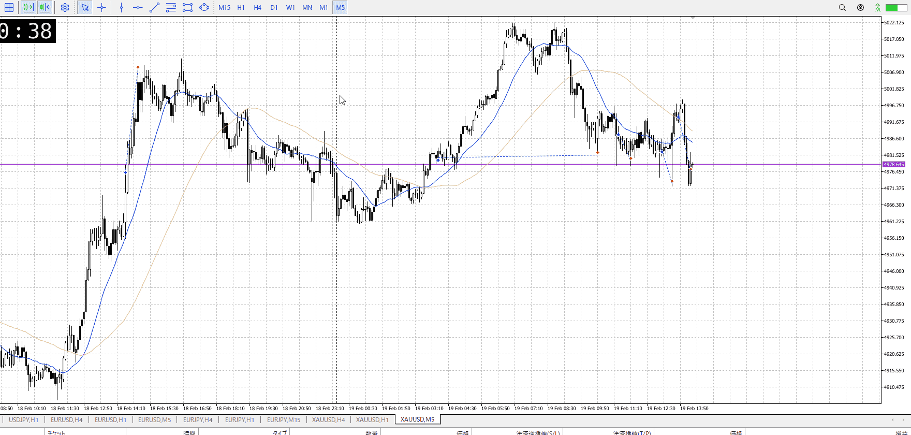
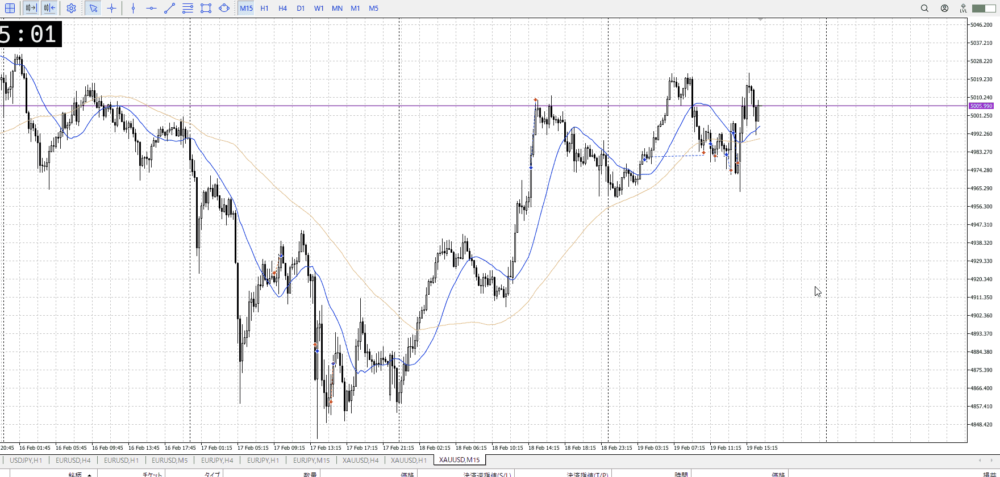

<画像>

`INPUT[inlineSelect(option(Range), option(Trend)):type]`

TPSL
```meta-bind
INPUT[toggle:TPSL]
```

Height
```meta-bind
INPUT[toggle:Height]
```
Width
```meta-bind
INPUT[toggle:Width]
```

Direction
```meta-bind
INPUT[toggle:Direction]
```
Incline_Ratio
```meta-bind
INPUT[toggle:Incline_Ratio]
```

手前の二回ミスが痛い
それなら押し目を狙ったほうがいい

これはさっきの押し目買いとは違い抜け、抜けなら平均は必要
前回がなんか弾かれた時点で買うなら様子見押し目が必要だった


これの青線との違いは、前の挙動かな
前は緩やかな落ち、揃った底と下髭だったけど
今回は落ちが登りに対して急降下で、下髭買いでダメ
抜けを行えるほど材料が無かったか


抜けが行える材料
この後の否定の急上昇は早い押し、実質抜けが可能
横幅と下振りで充分

一回目の下固まりRR重視と混同しない