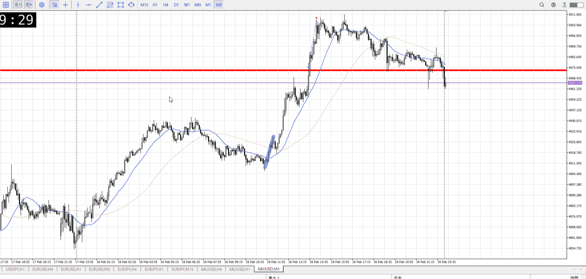
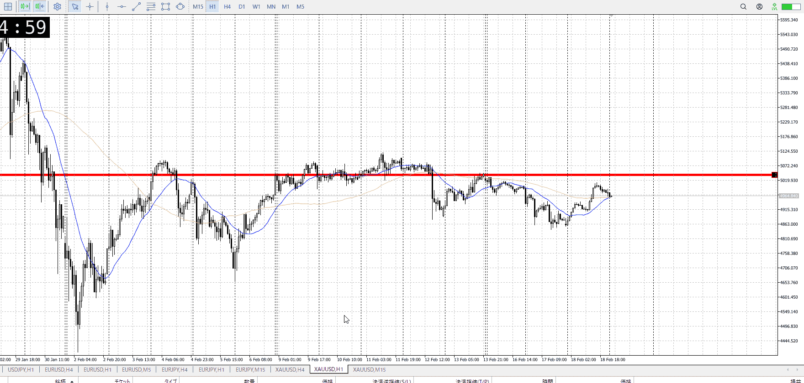

<画像>

TPSL
```meta-bind
INPUT[toggle:TPSL]
```

Height
```meta-bind
INPUT[toggle:Height]
```
Width
```meta-bind
INPUT[toggle:Width]
```

Direction
```meta-bind
INPUT[toggle:Direction]
```
Incline_Ratio
```meta-bind
INPUT[toggle:Incline_Ratio]
```

15m、1h上髭に下振りを見て上がったところを抜け買いしたが
横幅があまりに小さくないか？

前からの買いがあったのは事実で、1h売りとを見たいのも事実
1h上髭に対して15m下髭一つでは上がらないのは分かる、複数出す暇もなく上がっていって1hを裏切っただろうと思ったので買い


根っこから5mで買うのは本当に5mしかなかったはず
次の1h売りとの均衡は横幅を持って見ておきたかったはず
今までと違って抜きに妥当性がある、気はする
でも横幅が無さすぎて、後で良くない利確をした気もする


根っこから買うのはできたんじゃないか説
1h押し留めに15mネック割り

それに5mでの上昇、ここで確信をもって買い
そうすれば1h売りとの攻防を余裕を持って見て置ける
ただそれなら15mの上髭がちょっと辛い、それを抜いた陽線で一気に入る手くらい？

t
15m買いが一本で行われているというのが強い
上髭はあるが、トレンド転換初期で売りがゆっくりな中で、一本で上昇
これがあるなら上髭気にせず行ける


1hでも一本で明らかに上昇している
これの確定で買ってもいいくらい？

それらに対し、自分が入った地点はレンジの抜けでもなく、押し目買いでもない勢い任せ
後によくない