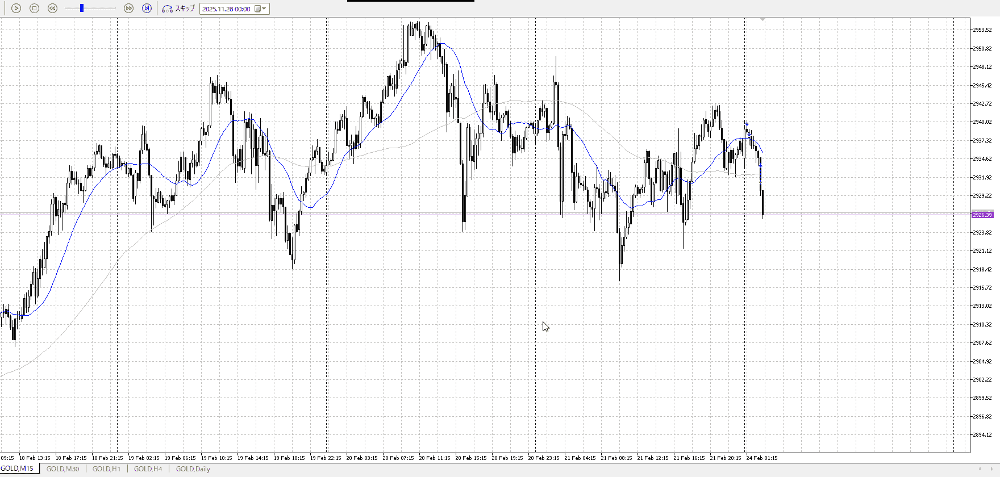
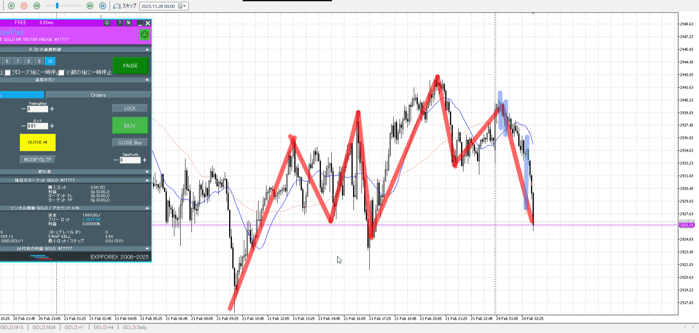

画像>

`INPUT[inlineSelect(option(Range), option(Trend)):type]`

TPSL
```meta-bind
INPUT[toggle:TPSL]
```

Height
```meta-bind
INPUT[toggle:Height]
```
Width
```meta-bind
INPUT[toggle:Width]
```

Direction
```meta-bind
INPUT[toggle:Direction]
```
Incline_Ratio
```meta-bind
INPUT[toggle:Incline_Ratio]
```

傾きがキツイ
上昇前の下降が結構早く、これを押し返せる勢いがまだ出きってない
下位足の平均も戻りますってなってないのでまだ駄目だった

最後の落ちてきたとこを買う戦略は、妥当に買えるとこならまだしもここではきつくね

