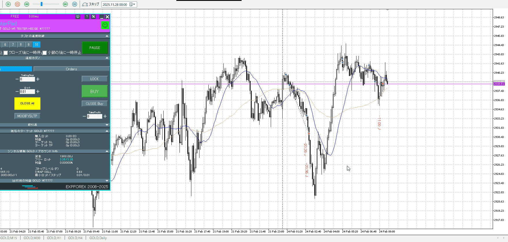
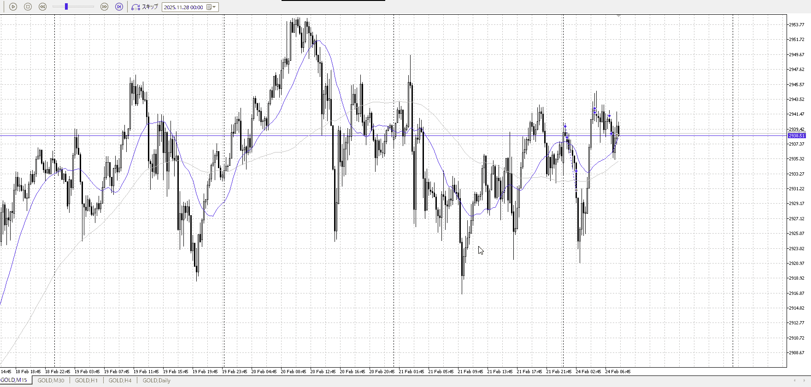

<画像>

`INPUT[inlineSelect(option(Range), option(Trend)):type]`

TPSL
```meta-bind
INPUT[toggle:TPSL]
```

Height
```meta-bind
INPUT[toggle:Height]
```
Width
```meta-bind
INPUT[toggle:Width]
```

Direction
```meta-bind
INPUT[toggle:Direction]
```
Incline_Ratio
```meta-bind
INPUT[toggle:Incline_Ratio]
```


はやすぎ
上で一回反応するからその後迄、はいいけどその後の押し待ちができてない
縦横だけで言うなら最後に買ったやつしかまともじゃない、切り下げがあるんでそこもあんまりだが、他よりマシ


