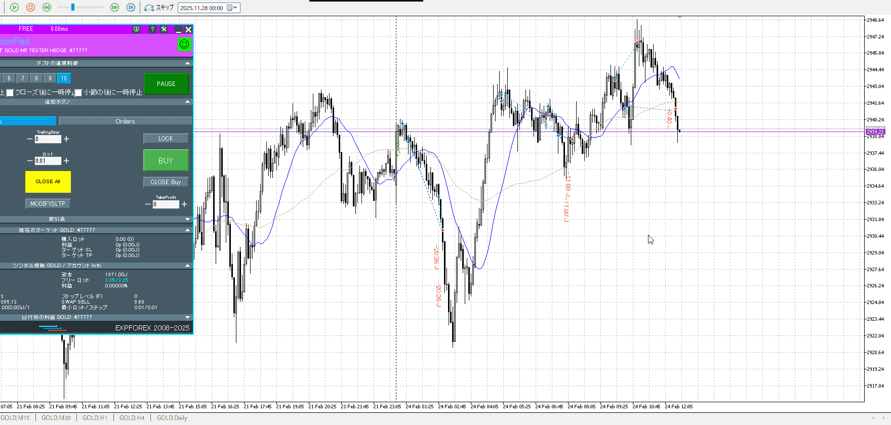

<画像>

`INPUT[inlineSelect(option(Range), option(Trend)):type]`

TPSL
```meta-bind
INPUT[toggle:TPSL]
```

Height
```meta-bind
INPUT[toggle:Height]
```
Width
```meta-bind
INPUT[toggle:Width]
```

Direction
```meta-bind
INPUT[toggle:Direction]
```
Incline_Ratio
```meta-bind
INPUT[toggle:Incline_Ratio]
```


今度は遅い
買いが分かっていたはずなので、下髭らへんで買っていきたい
二つあったので一つ上で利確したが、その一つ目が早すぎなので本来は0終了
この0終了自体はそこまで悪くないはず

