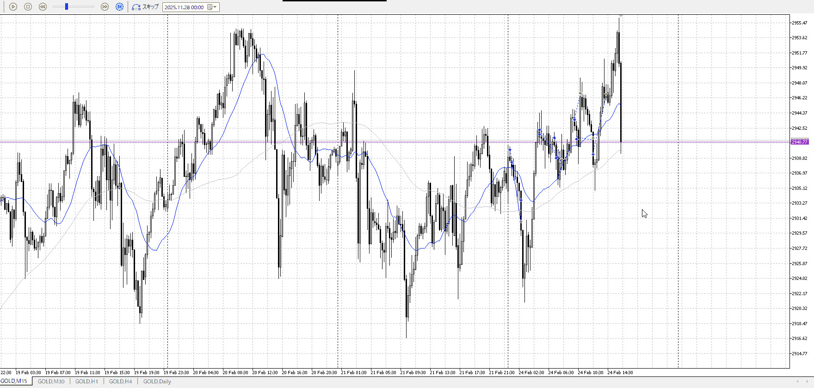

<画像>

`INPUT[inlineSelect(option(Range), option(Trend)):type]`

TPSL
```meta-bind
INPUT[toggle:TPSL]
```

Height
```meta-bind
INPUT[toggle:Height]
```
Width
```meta-bind
INPUT[toggle:Width]
```

Direction
```meta-bind
INPUT[toggle:Direction]
```
Incline_Ratio
```meta-bind
INPUT[toggle:Incline_Ratio]
```

前に買ったとこからの買い
前に下から買ってればもっと下からが出来たが、それよりも
利確が甘かった、1hの推進に乗って買ってるんだから利確も1h相当で

