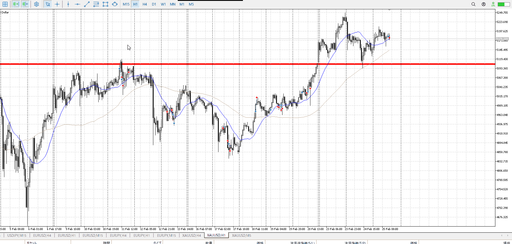
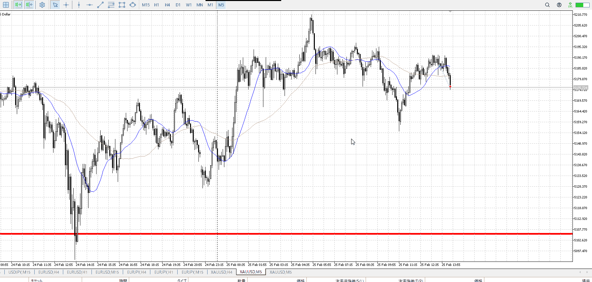
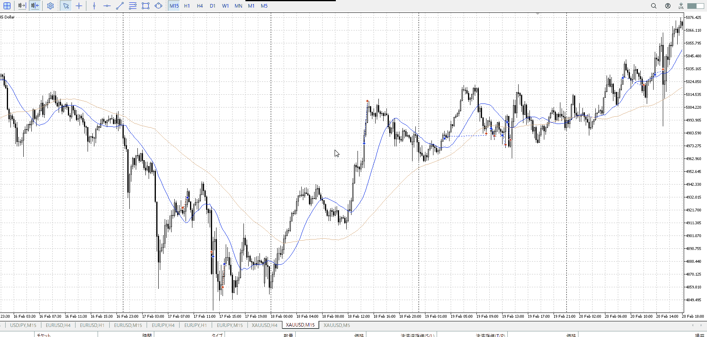
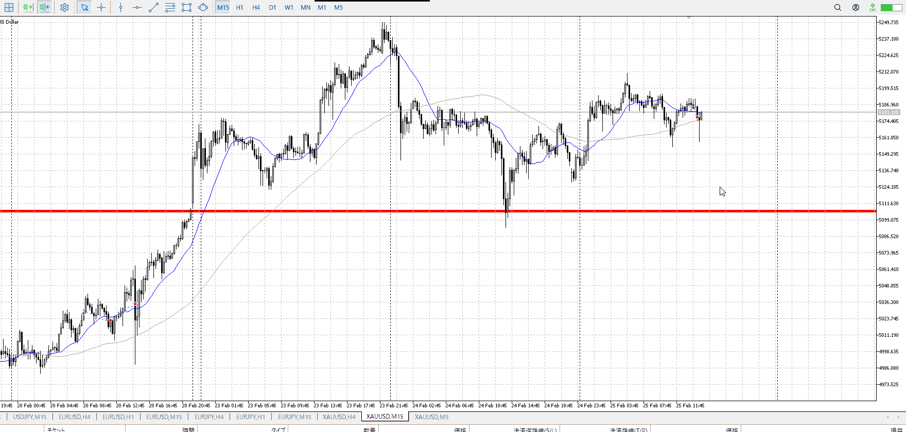

<画像>

`INPUT[inlineSelect(option(Range), option(Trend)):type]`

TPSL
```meta-bind
INPUT[toggle:TPSL]
```

Height
```meta-bind
INPUT[toggle:Height]
```
Width
```meta-bind
INPUT[toggle:Width]
```

Direction
```meta-bind
INPUT[toggle:Direction]
```
Incline_Ratio
```meta-bind
INPUT[toggle:Incline_Ratio]
```

比率が悪い、15m下降に対して上昇が遅い
あと、15mで買ったのに15mで買いたい場所じゃない
明確に5mも抜けてないので

時間帯としてもその根拠で買うのは厳しい

5mで5mの髭につられて買っただけのもの
損切に至っては5mですらないぞそのレンジもどき

![[../../images/len20260225T095337 2026-02-25 22.05.33.excalidraw]]

別にこれは横幅云々じゃなく、買う場所探し



手本にしてたこれは、上昇の始め
今は落ちから伸びが緩やかというところ、上昇の始めではない

5mではexcalidrawの絵で描いた赤線ポイントは意味ある落ち
これの否定を本来は見る必要があり、手本でそれをスキップしたのは上昇のはじめとか15m買い場とか
今回の場所は15m買い場ではない

下髭を出し始めてから、そこで下髭を出すなら話が違うと入ったわけだが
何が違うのか考えてみる

主張はここで落ちると思っていた中で下髭を出したのだから、下に行かないことを証明した

しかし15mでは買いたくない、5mでも抜け程度の場所
その中で5m15m下髭を、それも上を抜いたわけでもない下髭の一本では変わらない
複数あったら下に行かない証明と言っても良いが、それもない

長い下髭というには、環境足で意味ある、せめて15ｍで意味あるくらいの下髭でないと
これは5ｍのレンジでもないとこに触れて戻ってきただけの、大した強さのない下髭
これでは15ｍの売りを、5ｍの売りを抜くのは無理
というか5ｍが売りの状態なのおかしい、15ｍに勝ちたいのに5ｍ買いトレンドのサポートすらないぞ

誰に勝ちたくて、それに見合うサポートがあるのか

押し目買い云々、1hで遅い云々じゃなく
赤線で買いを考えるか否かをまず明らかにすべきだった
いや明らかになってたんだけど、一旦待てって結論出したけど
それで結局どうするって待てなんだけど

環境足で意味ある髭なのかを次からは



例えばこれくらい出してれば、同じところで意識されてるということで意味ある髭
これで買えという意味でも売れと言う意味でもない、止まったのは見てるから次に買いたい場所で自信を持つ材料にする

![[../../images/len20260225T095337 2026-02-25 22.05.33.excalidraw]]

もちろんこんどこそこれ

