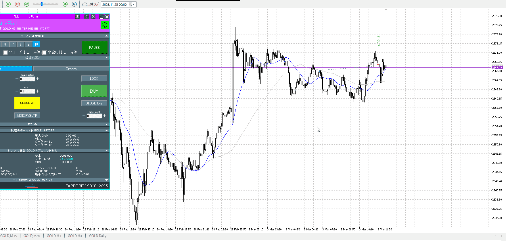
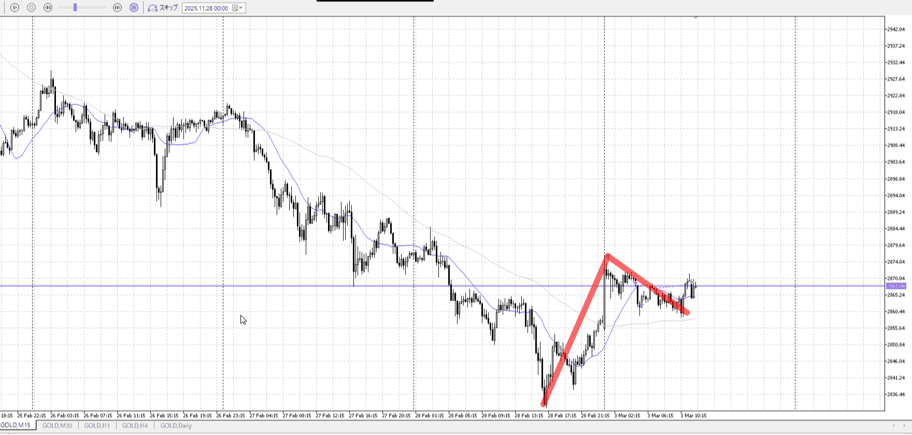

<画像>

`INPUT[inlineSelect(option(Range), option(Trend)):type]`

TPSL
```meta-bind
INPUT[toggle:TPSL]
```

Height
```meta-bind
INPUT[toggle:Height]
```
Width
```meta-bind
INPUT[toggle:Width]
```

Direction
```meta-bind
INPUT[toggle:Direction]
```
Incline_Ratio
```meta-bind
INPUT[toggle:Incline_Ratio]
```

一回目はまだわかる、二回目は早すぎこれを一回目として次のここまで折りてきたところを狙いたい
そこから上がるかなんてわからんし

三回目も早い、前の下降を軽視してる
これのケアとして高値更新とか挟みたいところ

なので撮影時、5m高値更新程度で
15m下髭から5m下髭を買っていきたいところ