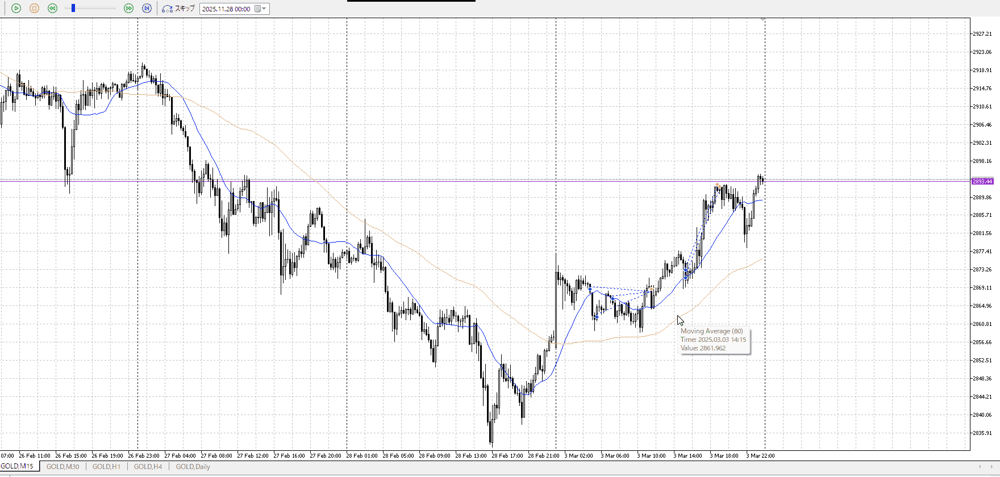
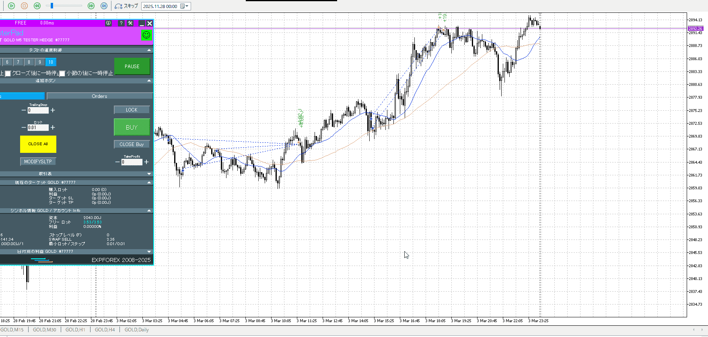
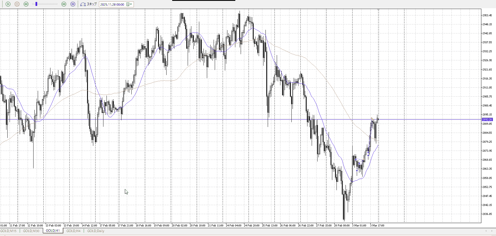

<画像>

`INPUT[inlineSelect(option(Range), option(Trend)):type]`

TPSL
```meta-bind
INPUT[toggle:TPSL]
```

Height
```meta-bind
INPUT[toggle:Height]
```
Width
```meta-bind
INPUT[toggle:Width]
```

Direction
```meta-bind
INPUT[toggle:Direction]
```
Incline_Ratio
```meta-bind
INPUT[toggle:Incline_Ratio]
```

100点
見てるんならこの後の上昇を見るとかあるかもだけど、それは二つ実際に入れるようになってからな

これが上手くいったのは、まず横幅待ったこと
天井作って止まったのに対して、レンジ作って抜けて、その押し狙い

一つ前の損切点あたりは下を確かめて上昇
これで下髭出したなら入ったかもだけど、無かったからしゃーなし
ここの下降自体は強くない、レンジを下まで抜いたわけでもなし

今回は横幅に加え、押し目で下髭を出してそれに当てた



100点は後者の買いに対して
前者の買いは、若干早い
前者も15m下髭確定だから悪くはないが




つーか1hの売り前やん
どう考えてもここで手放すのが正解だわ

こういうレンジ押しの流れと同じくらい、押し目や否定後の流れとかも頭に刻む
どう刻むんだよ
[エントリー](../エントリー.md)
