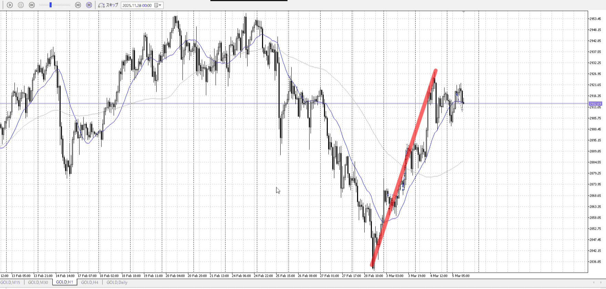
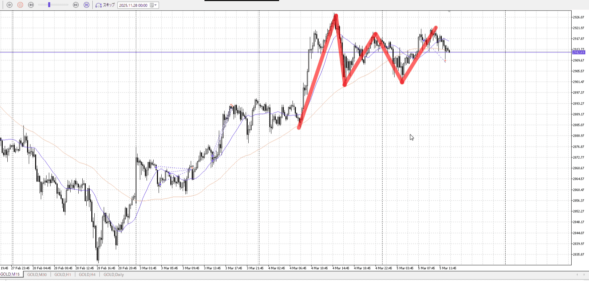

<画像>

`INPUT[inlineSelect(option(Range), option(Trend)):type]`

TPSL
```meta-bind
INPUT[toggle:TPSL]
```

Height
```meta-bind
INPUT[toggle:Height]
```
Width
```meta-bind
INPUT[toggle:Width]
```

Direction
```meta-bind
INPUT[toggle:Direction]
```
Incline_Ratio
```meta-bind
INPUT[toggle:Incline_Ratio]
```

厳しかった
1hと対抗するので、15mで明確な抜けが欲しい

[エントリー](../エントリー.md)
これで説明してる、ちょっと浮いたレンジ
明確な抜けを待てばいい

