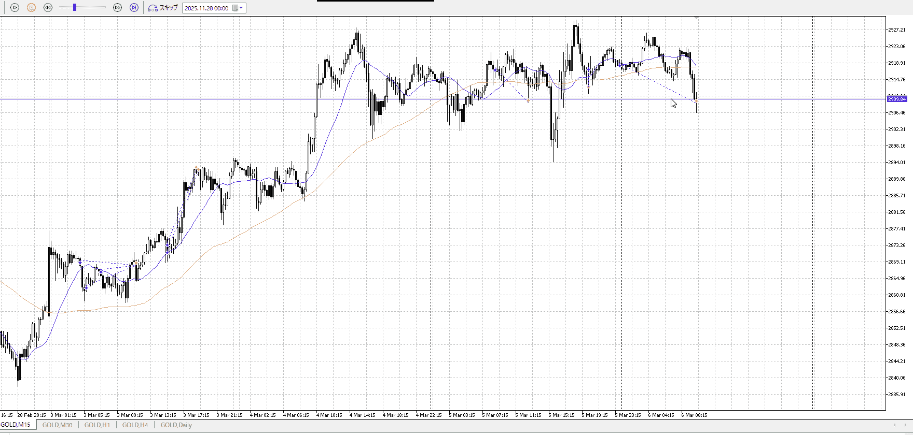
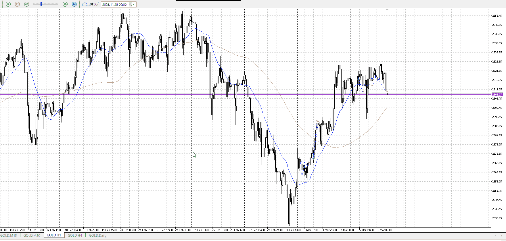

<画像>

`INPUT[inlineSelect(option(Range), option(Trend)):type]`

TPSL
```meta-bind
INPUT[toggle:TPSL]
```

Height
```meta-bind
INPUT[toggle:Height]
```
Width
```meta-bind
INPUT[toggle:Width]
```

Direction
```meta-bind
INPUT[toggle:Direction]
```
Incline_Ratio
```meta-bind
INPUT[toggle:Incline_Ratio]
```

一回目は明確な抜けが欲しいので早すぎ
二回目は前の下降を甘く見すぎ
三回目はかなりいい線だろうけど、朝でそれで上がらないならやっぱきついか。

また、三回目時点でも1hの上昇と横幅は同程度ではない
