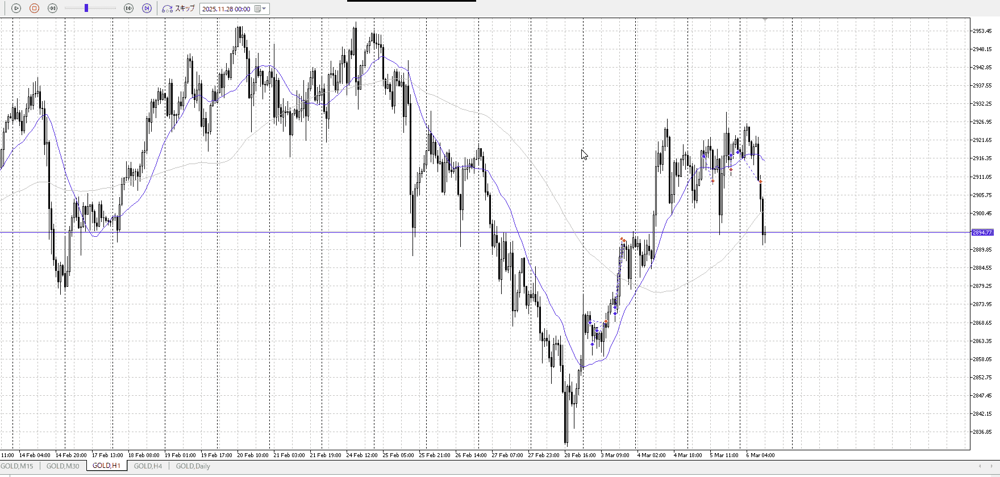
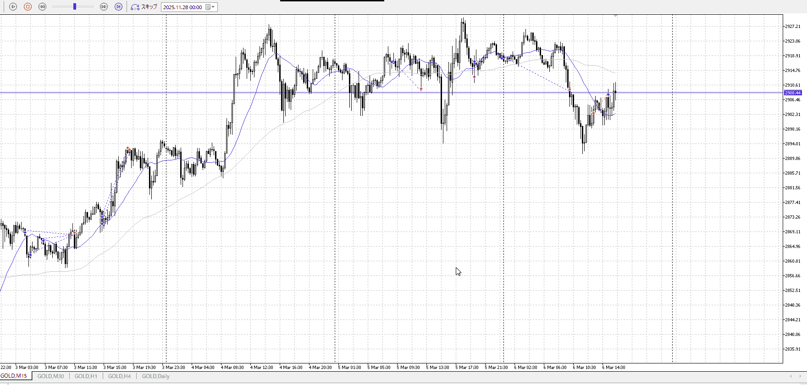
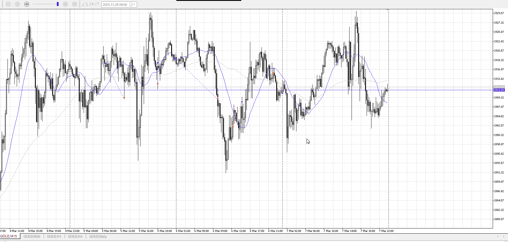

<画像>

戻り売りたい



冷静になれ、戻り売るなら小さい足でレンジ抜きとかだ
ここは調整内に当たるわけだから調整終わるまで待て



レンジらしい調整終わり売り
次の日やるつもり無かったのでここ切り
ドレンジとして七割狙えばこれいけたか
<画像>

`INPUT[inlineSelect(option(Range), option(Trend)):type]`

TPSL
```meta-bind
INPUT[toggle:TPSL]
```

Height
```meta-bind
INPUT[toggle:Height]
```
Width
```meta-bind
INPUT[toggle:Width]
```

Direction
```meta-bind
INPUT[toggle:Direction]
```
Incline_Ratio
```meta-bind
INPUT[toggle:Incline_Ratio]
```
