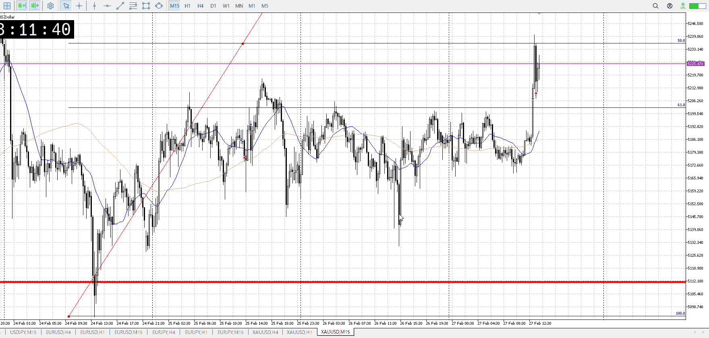
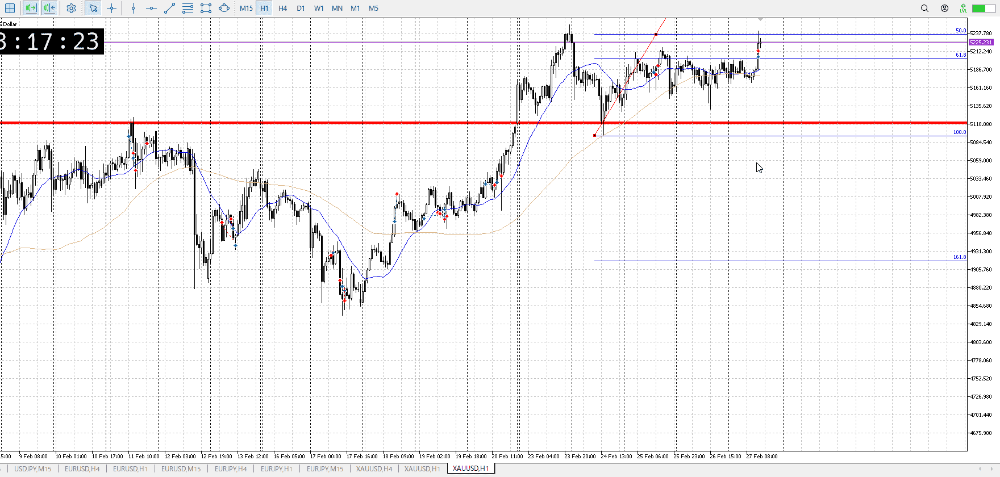
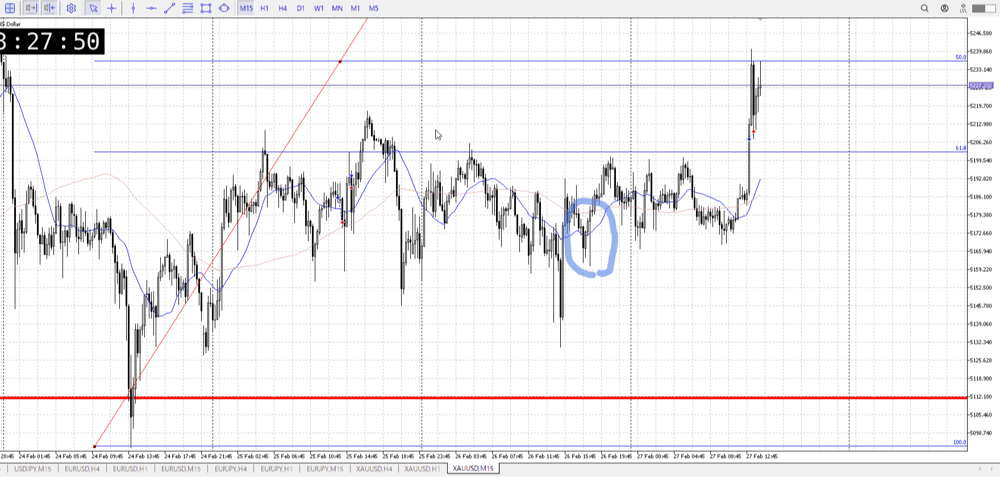

<画像>

`INPUT[inlineSelect(option(Range), option(Trend)):type]`

ルールに沿っていた
```meta-bind
INPUT[toggle:rule]
```

勝った
```meta-bind
INPUT[toggle:OK]
```


レンジ抜け。T。

1hの一波が一日の中、三日半溜めた
一日調整、一日上昇、一日上昇否定でレンジと考えると、完全にレンジ
十分損切が溜まってる、これを抜くなら一気に伸びる
なので抜け

前の上昇の七割を考えていた、1h高値の売りが大きく同値
この売りの大きさは分からない、もっと早く入ってればかわせた

1hの確定的にこの後を持っていける根拠もある

金曜は上昇のままで終わることが多い
その後の上昇を示す

三日半溜めが大きいので、その要素はフレーバー

レンジの下から買う方法は確かにあるが、今回は1hレンジで1hで見て下がそんなに揃ってない
何処から買うかが分かりにくい、大きな下振りがあるなら考えるが

下振りで上を抜けなくても、下がらないという下髭があるなら買っていきたい
青丸部分
ここは深夜なのでどの道だけど

