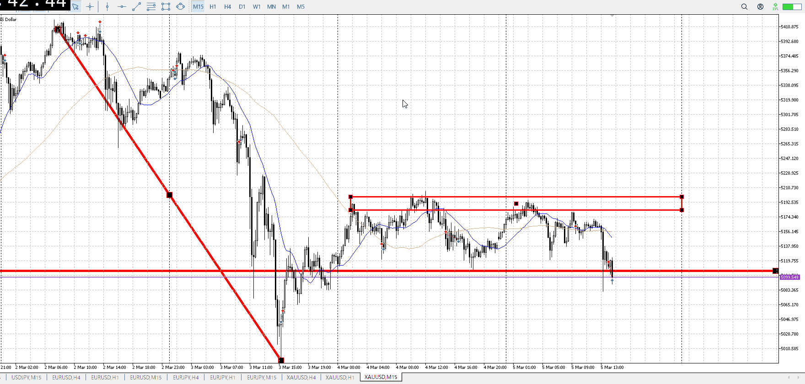

<画像>

`INPUT[inlineSelect(option(Range), option(Trend)):type]`

ルールに沿っていた
```meta-bind
INPUT[toggle:rule]
```

勝った
```meta-bind
INPUT[toggle:OK]
```

tの

まず1h戻り売りを考えてた
十分時間を取った

横にグダグダ伸びて、小さくなっていった
そこから特異な一本

下髭という懸念はあるものの、1hを背に取るには十分な背景
その懸念も次の確定が上がりづらく上髭、十分潰れた