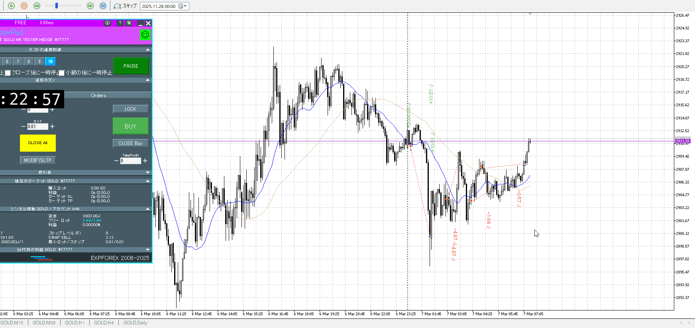

<画像>

`INPUT[inlineSelect(option(Range), option(Trend)):type]`

ルールに沿っていた
```meta-bind
INPUT[toggle:rule]
```

勝った
```meta-bind
INPUT[toggle:OK]
```

一回目は引きつけが足りてない
二回目は切るのが遅い

参考にしているものは、1hの売りがいて1hの買いはまだ来てなかったとこ
これはレンジ内で1hの買いが近い、そんなに自信もって売れない

なので下がり切らない、切り上げを差しはさむならもう無理
本当は0じゃなく止まって一本上に行ったとこの時点で引きつけて切りを考えるべき


