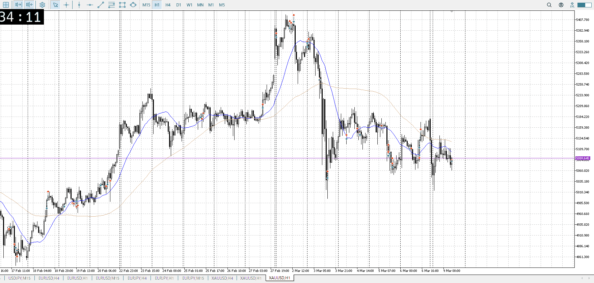
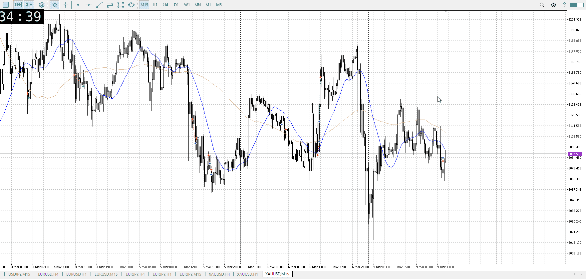
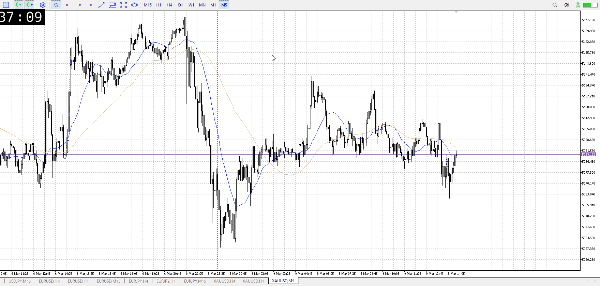

<画像>

`INPUT[inlineSelect(option(Range), option(Trend)):type]`

ルールに沿っていた
```meta-bind
INPUT[toggle:rule]
```

勝った
```meta-bind
INPUT[toggle:OK]
```

ほぼルールなんだけど、損切早かったので

1hが底で帰ってるので買いがいることは明白
しかし上昇は半値近くで二回三回と止まっており、下降でもおかしくない
その中で15mで揃い始めた下を割った、売り
利確は理想が1h安値、ただ月曜夜なので早めに


5mで直近の安値帯まで来ると想定しているはず、ならもう少し上でも
直前で1h確定してるが、焦って入るくらいなら入らないほうがマシ

1h確定から一本で売り場に来る方が怪しくね
念願の抜きにしては浅くね
この二点があるので、入りにくく伸びにくさはある

明確に悪かったのは損切位置
直近のレンジ迄は来る予想が常にあるはず、ならもっと上
ここはレンジと言うほど横取ってないけど、直近の売り場の中での怪しい場所ではある

そのうえで利確を月曜夜かつさっきの怪しさ考慮すれば行けた
理想論っぽいが、月曜夜ならそれくらい必要なんじゃないか

直近のレンジまで来る予想

その後の買いだが、売りたかったポイントぶち抜き
しかし前のように上に平均が出てくるほど時間取ってるわけでもないので、やっぱ難しそう


