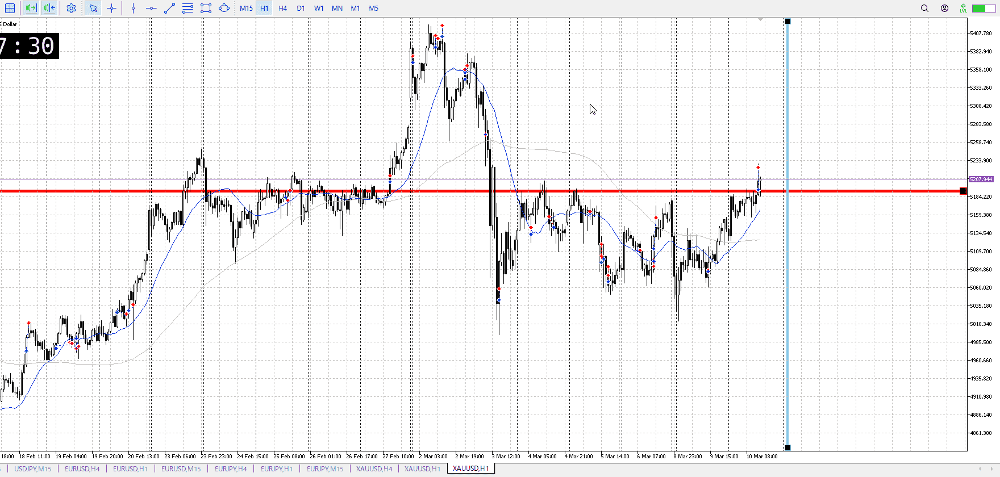
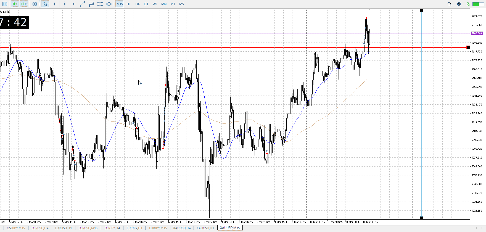
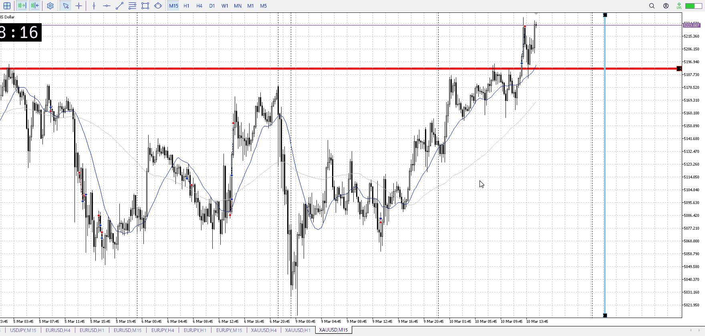

<画像>

`INPUT[inlineSelect(option(Range), option(Trend)):type]`

ルールに沿っていた
```meta-bind
INPUT[toggle:rule]
```

勝った
```meta-bind
INPUT[toggle:OK]
```

もう夜にあたるんじゃないかと早めに切ってしまったが、これがどうなるか

というか15m確定押しで買うべきでは
夜に当たるんじゃないかと切るにしても、直近の高さまでは取りたいところ
下髭ギリギリを攻めるのなら、抜けで買うのは合わない

ロンドンが1:00まで
その一時間前の0時まではいけるんじゃないか
だから伸びないのは伸びないだろうけど、直近の高さまでは取りたいところ


はい
直近までは取れよ、1hを否定して伸びてるんだから

t
深夜は流れを変える大きな力が無い
なので短期なら流れに沿える、という考えもある
