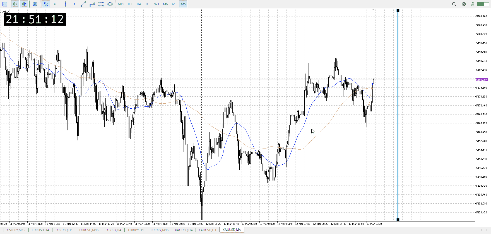
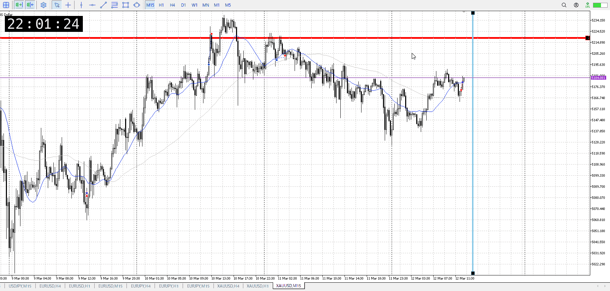
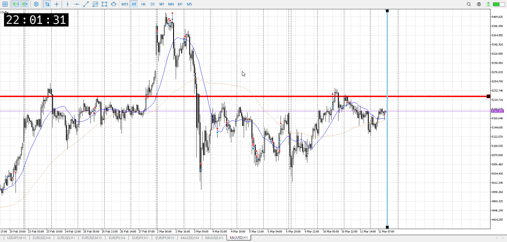

<画像>

`INPUT[inlineSelect(option(Range), option(Trend)):type]`

ルールに沿っていた
```meta-bind
INPUT[toggle:rule]
```

勝った
```meta-bind
INPUT[toggle:OK]
```

1hの売りがある
15mは先ほど買いになった
5mも買いになった

これに対してこの中で1hの最後の売り

短期が買いから調整として下に行く、っていうのがまあまあある話
15mも買いになったのが辛かったか
そんなに出てないからいけるかと思ったが、これは主観的で駄目だった


あとは15mも1hも平均が上にある
売りはやっぱそれできつい、証拠の数的にきついとこだった

1hは売りなので、損切後に買いでついていくのはそこそこ難しい
確かに1hの損切が巻き込まれるとも思えるんだけど、それにしては1h損切が溜まっているようなレンジではない
なので買いでついていくのはやっぱり難しい
それなら15mの横幅取っておきたいね、この縦線くらいまで