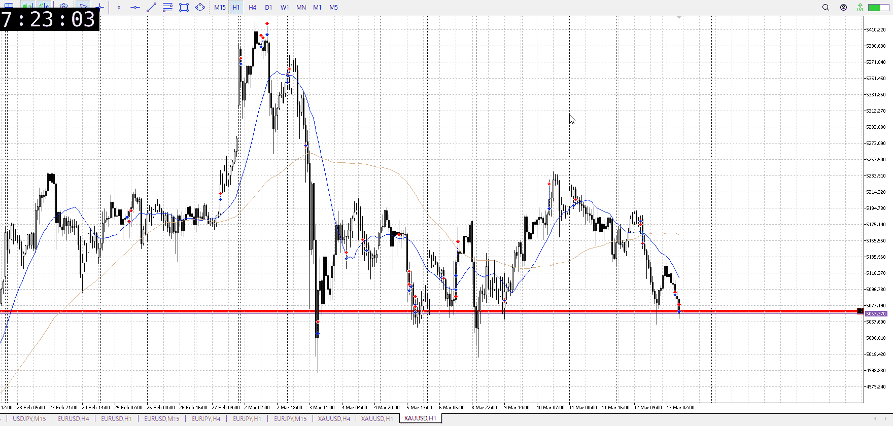
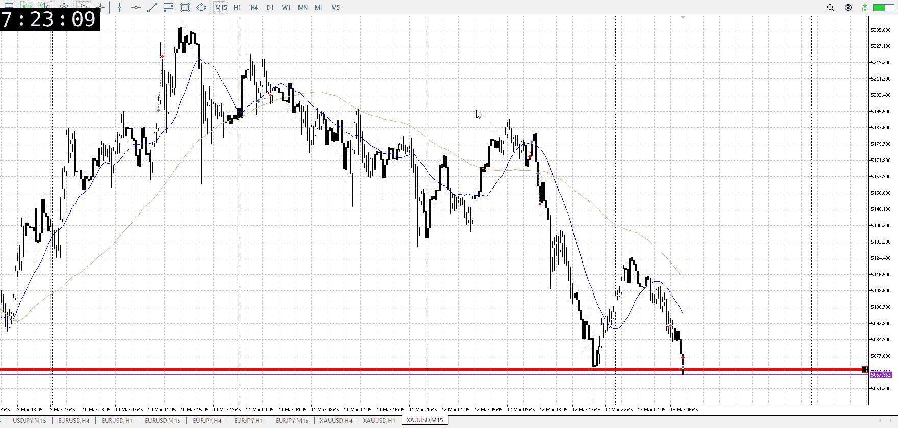
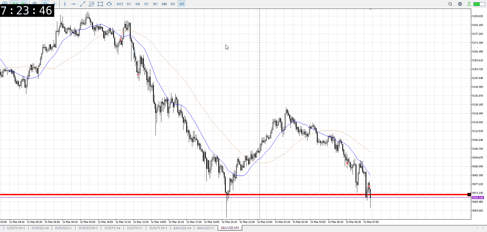

<画像>

`INPUT[inlineSelect(option(Range), option(Trend)):type]`

ルールに沿っていた
```meta-bind
INPUT[toggle:rule]
```

勝った
```meta-bind
INPUT[toggle:OK]
```

t
```meta-bind
INPUT[toggle:t]
```

予想してた形の下に行くやつ
15mで下向き始めを5mで明確抜け待って取る

目線そろいと直前の下降があってのやり方
普段からはやらないこと