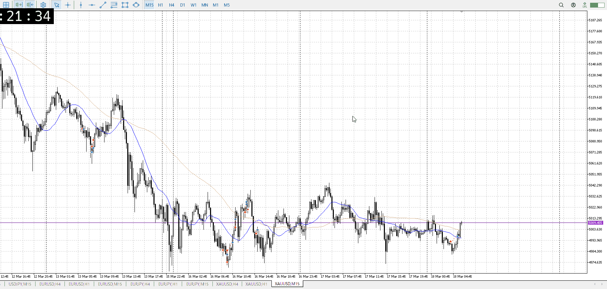
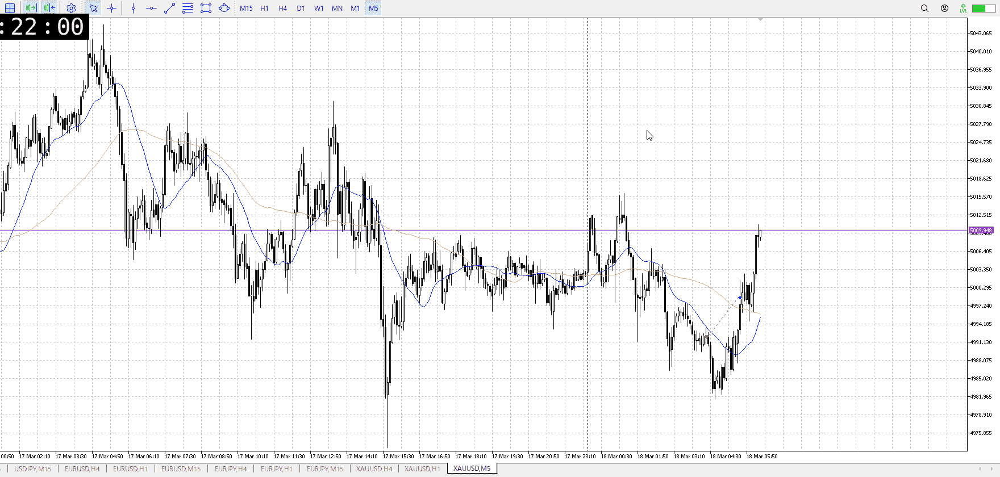

<画像>

`INPUT[inlineSelect(option(Range), option(Trend)):type]`

ルールに沿っていた
```meta-bind
INPUT[toggle:rule]
```

勝った
```meta-bind
INPUT[toggle:OK]
```

t
```meta-bind
INPUT[toggle:t]
```

t
良い、ただ利確が近くないか

FOMC対策で近づけてた

昼を避けて入る
下がり切らず一気に上昇、15m確定がつらめで入り直しもちょっと
ここからレンジ上から売りを指す方法は、勝率が低いんで無し

