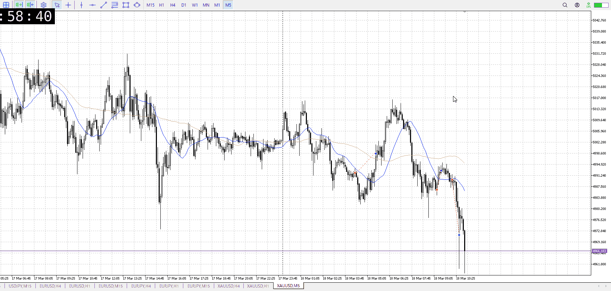

<画像>

`INPUT[inlineSelect(option(Range), option(Trend)):type]`

ルールに沿っていた
```meta-bind
INPUT[toggle:rule]
```

勝った
```meta-bind
INPUT[toggle:OK]
```

t
```meta-bind
INPUT[toggle:t]
```

FOMCで上が塞がれてる前提、底からの戻り上髭確認
ここで既に売れた

また、大きな恬として利確後、もう一つ5m髭で売れた
一つの確定を二つに割る