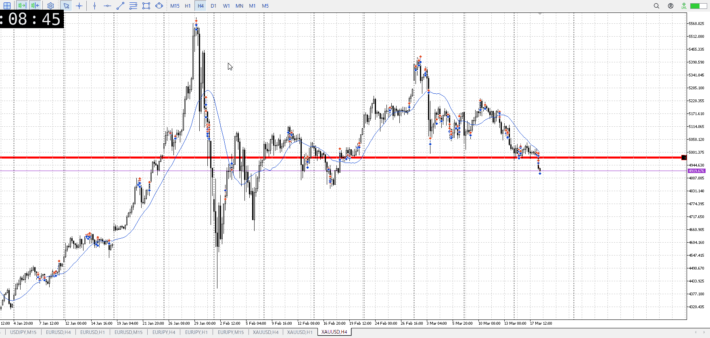
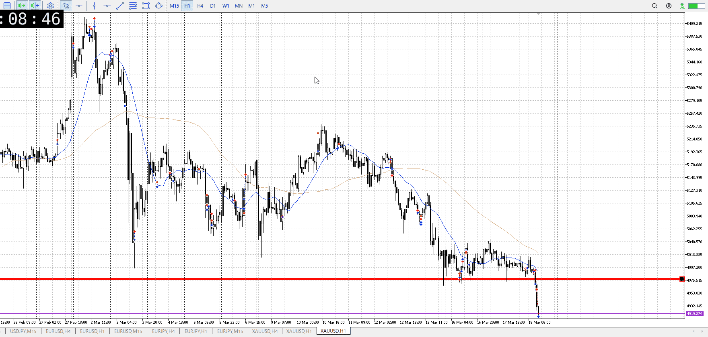
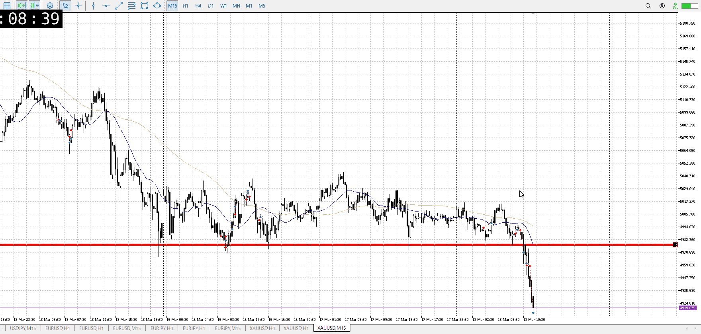
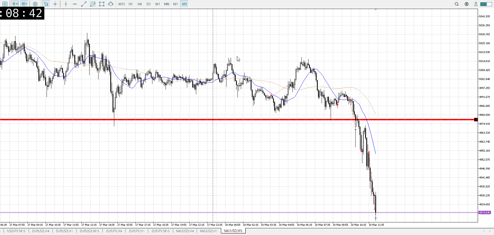

<画像>

`INPUT[inlineSelect(option(Range), option(Trend)):type]`

ルールに沿っていた
```meta-bind
INPUT[toggle:rule]
```

勝った
```meta-bind
INPUT[toggle:OK]
```

t
```meta-bind
INPUT[toggle:t]
```

多分ルール……

FOMCが怖いので、前回の下降の七割落ち
ただその下降に15m使うか、1hじゃないのかというとこ
1hの七割なら4hの前回底くらいになる、いけない範囲じゃないが

うーん、むずい
この後を見て正誤判断
