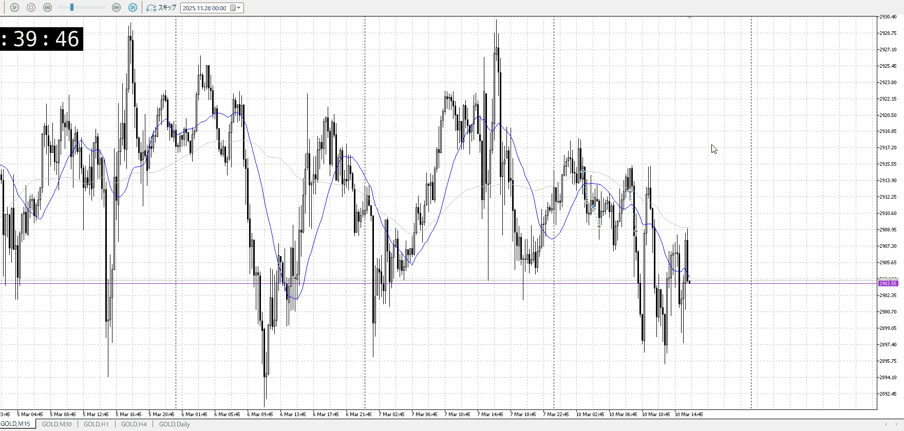

<画像>

`INPUT[inlineSelect(option(Range), option(Trend)):type]`

ルールに沿っていた
```meta-bind
INPUT[toggle:rule]
```

勝った
```meta-bind
INPUT[toggle:OK]
```

t
```meta-bind
INPUT[toggle:t]
```

一回落ちたなら戻り売りの趨勢を見るとこ
ここで買うと上昇先っちょで買うことになって駄目

三回目が十分時間たってて買いとしてはいい
勝てなかったけどそれは戻り売りが勝ったってことで