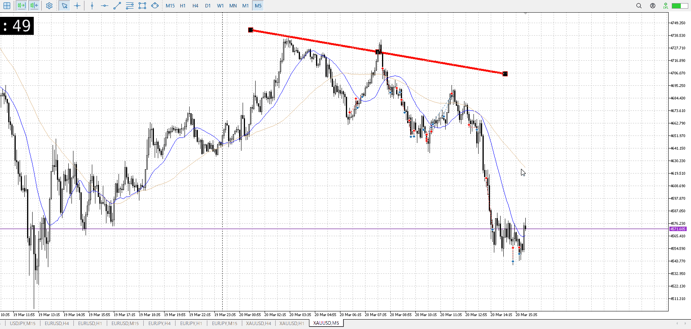

<画像>

`INPUT[inlineSelect(option(Range), option(Trend)):type]`

ルールに沿っていた
```meta-bind
INPUT[toggle:rule]
```

勝った
```meta-bind
INPUT[toggle:OK]
```

t
```meta-bind
INPUT[toggle:t]
```

4hの売りがあった
だから1h確定という遅さで入っても何とかなった、普段でやったら損切デカすぎて飛ぶ

上へ向かう最中の買い、これが早めに折れて5mの小さい底を抜き
この時点で売りを取りたい、ここからが正解

