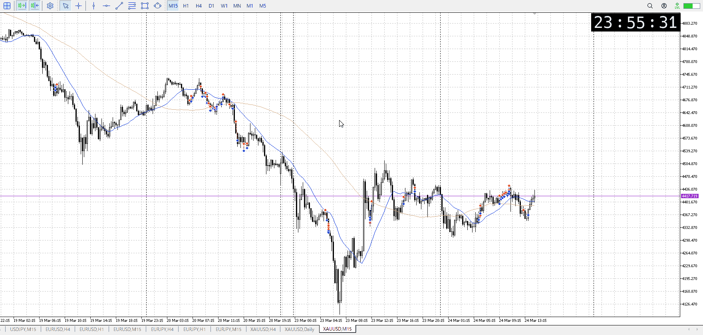

<画像>

`INPUT[inlineSelect(option(Range), option(Trend), option(Over)):type]`

ルールに沿っていた
```meta-bind
INPUT[toggle:rule]
```

勝った
```meta-bind
INPUT[toggle:OK]
```

t
```meta-bind
INPUT[toggle:t]
```

上に飛びぬけるも、想定のVにならず横這い
さらに天井からの落ちで売りを考えることに

結果は落ちず
これを元に買えるかは、一見そもそもオーバーシュートにしては上がらない横幅取りすぎな中で売り否定程度で今更上がるのかという疑問があるけど

短期では買えるが、方向感はない
方向出るまで待つが吉