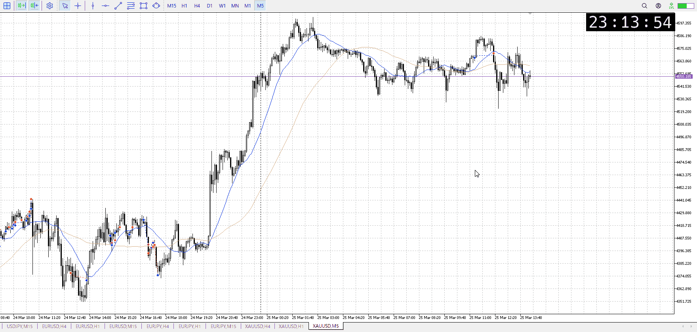
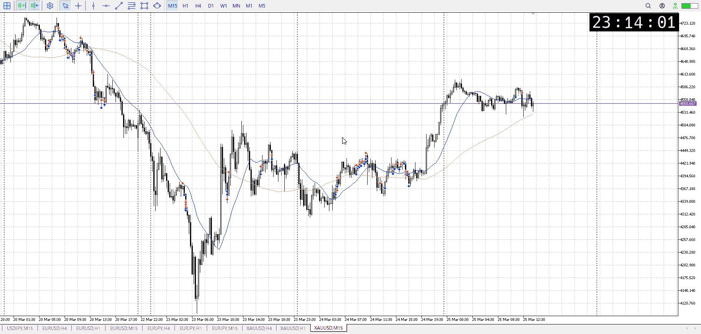

<画像>

`INPUT[inlineSelect(option(Range), option(Trend), option(Over)):type]`

ルールに沿っていた
```meta-bind
INPUT[toggle:rule]
```

勝った
```meta-bind
INPUT[toggle:OK]
```

t
```meta-bind
INPUT[toggle:t]
```

短期買い
上抜けを期待したが、その前に落ちた

上位足の理想としてはもっと下の、前回レンジ近くでうろついてほしいはずで
だから落ちること自体は驚きはない

同じく短期買いを仕掛けたいが、さっきのように絶好のレンジはなかなか
続いた短期買いで売りが溜まる、下抜けしたら1h後押しで一気に落ちるかも
だから買いも絶好の物でないと危なくて仕掛けられない

