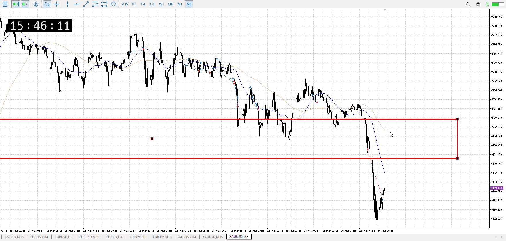

<画像>

`INPUT[inlineSelect(option(Range), option(Trend), option(Over)):type]`

ルールに沿っていた
```meta-bind
INPUT[toggle:rule]
```

勝った
```meta-bind
INPUT[toggle:OK]
```

t
```meta-bind
INPUT[toggle:t]
```

切り下げ底抜けの抜け売り
昨日下げ、今日朝が抜けずに落ちのコンボからなので自信は持てる


