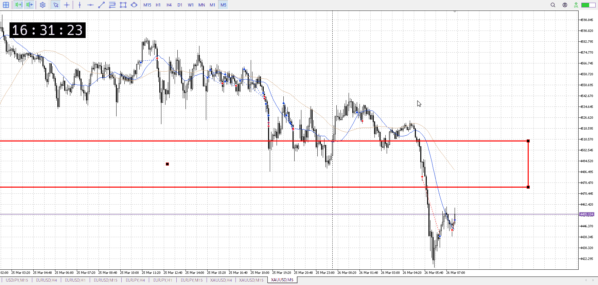

<画像>

`INPUT[inlineSelect(option(Range), option(Trend), option(Over)):type]`

ルールに沿っていた
```meta-bind
INPUT[toggle:rule]
```

勝った
```meta-bind
INPUT[toggle:OK]
```

t
```meta-bind
INPUT[toggle:t]
```


次は15mのサポートを受けてからでないと落ちにくいはず

前にいろいろ方向買えてたのはレンジの中で方向感が無かったから
ここは方向感があるのでしっかり勢いを貰ってから

途中から入るのでも、同じように
ちゃんとやる、それは決して残弾じゃない