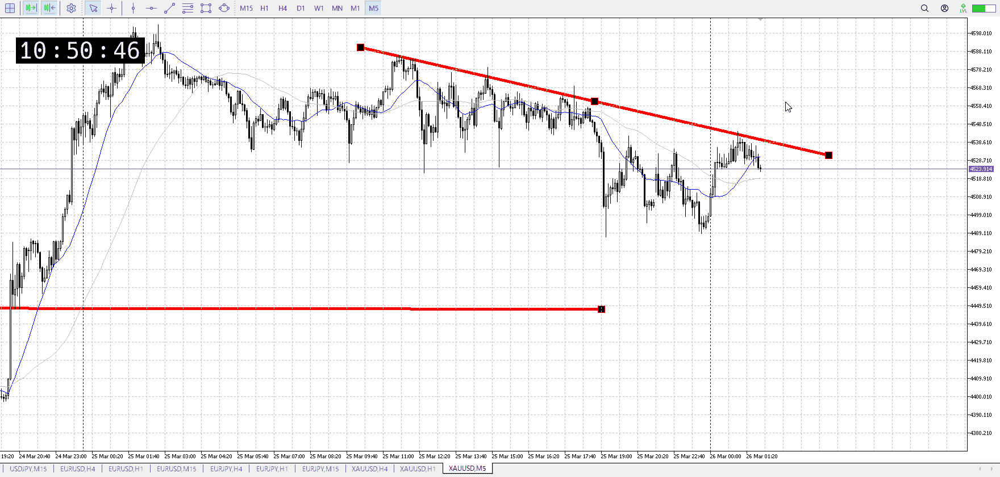
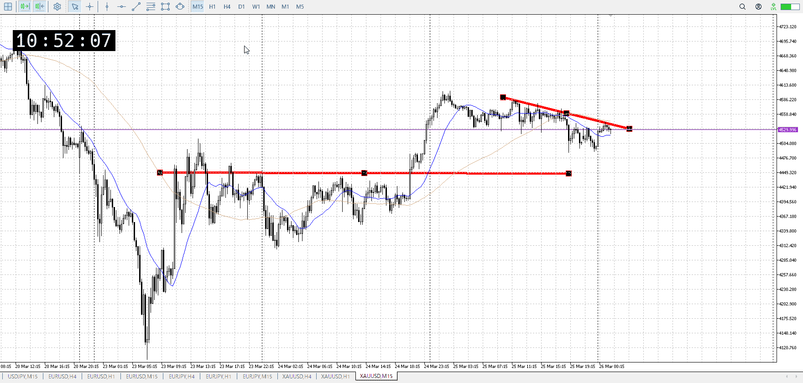
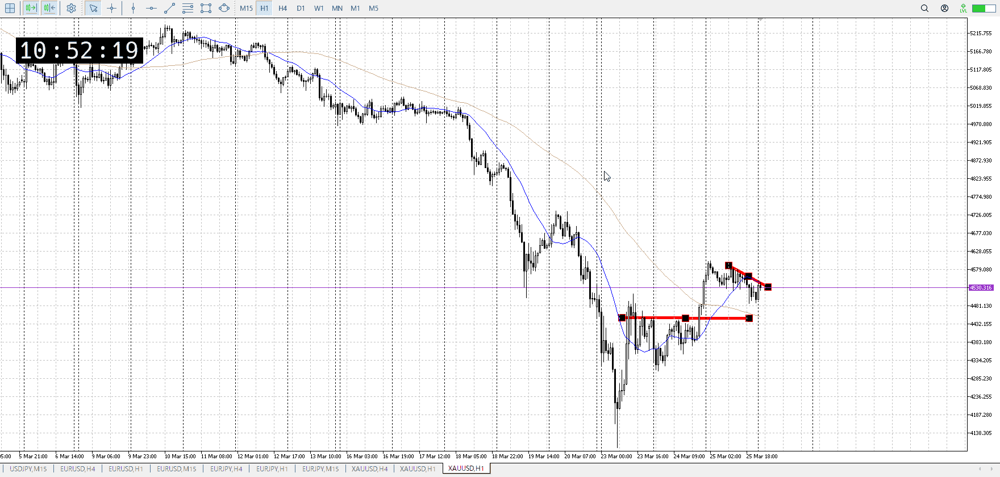

<画像>

`INPUT[inlineSelect(option(Range), option(Trend), option(Over)):type]`

ルールに沿っていた
```meta-bind
INPUT[toggle:rule]
```

勝った
```meta-bind
INPUT[toggle:OK]
```

t
```meta-bind
INPUT[toggle:t]
```

ルールとしては結構妥当だったが、切り下げ勢に気づいてなかった
切り下げ勢を越えてもう少し時間が経ち、1hA越えてから入り直す
昼後かな、今からもう一回は昼に突っ込むから

事後だが、上へのはみ出が少ない
なので上への力はあんまない

t
前回で買いは一度否定され、下で止まっている
なのでこれを否定し返してからでいい

下から買うなら昨日の1hの下髭から

買いは三日前1d下髭
そろそろ期限キレ

時間がかかれば下降が強くなる