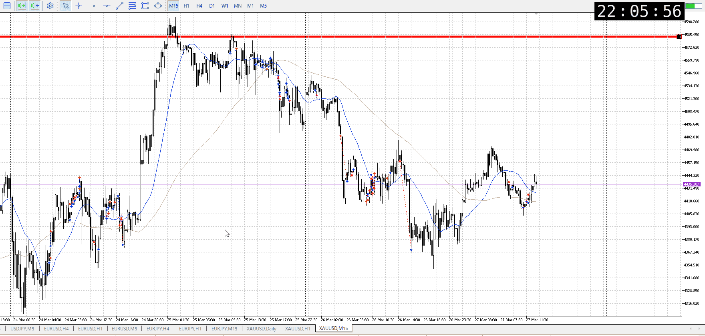
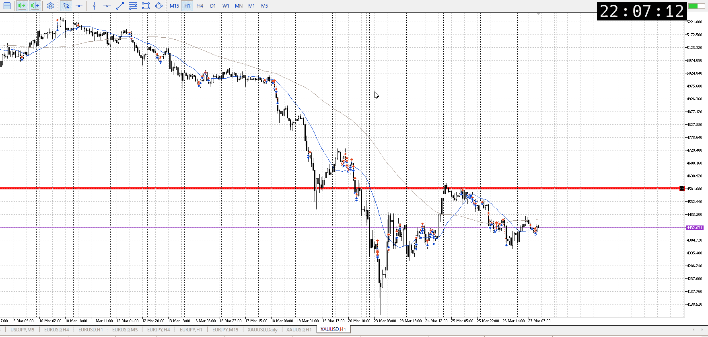
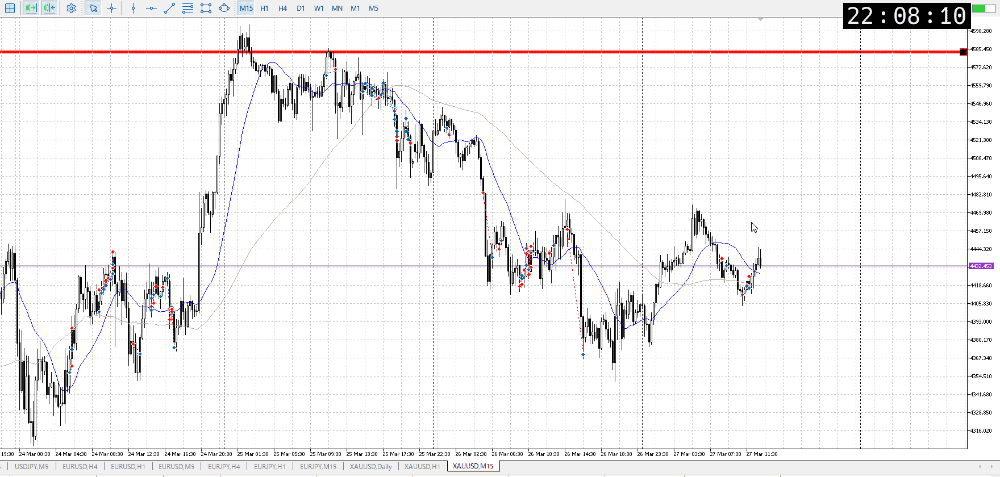

<画像>

`INPUT[inlineSelect(option(Range), option(Trend), option(Over)):type]`

ルールに沿っていた
```meta-bind
INPUT[toggle:rule]
```

勝った
```meta-bind
INPUT[toggle:OK]
```

t
```meta-bind
INPUT[toggle:t]
```

ルールというか、流れに沿った戻り売り



これは1h
平均線の上にいるため、リスクが高い
なので早めに売る必要がある、今回はちょっと遅い
無しではないが



15mも平均と平均の間にあり、微妙
だからこそより上から売りたい