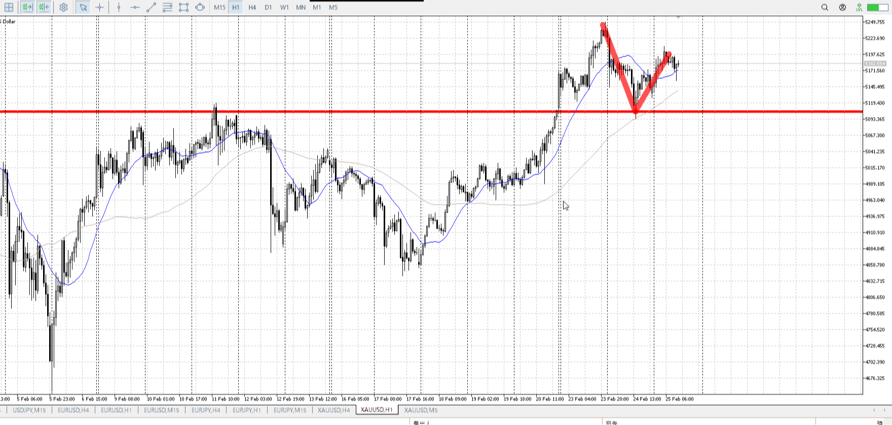
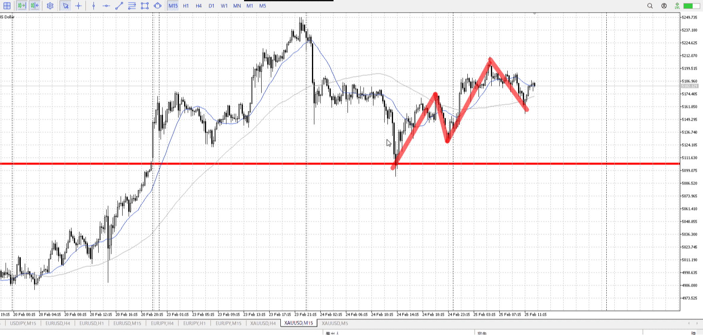
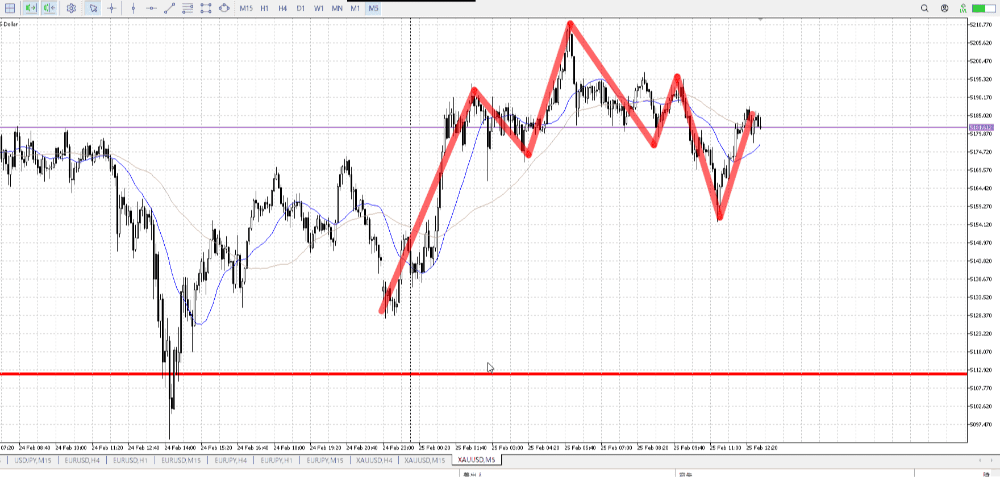
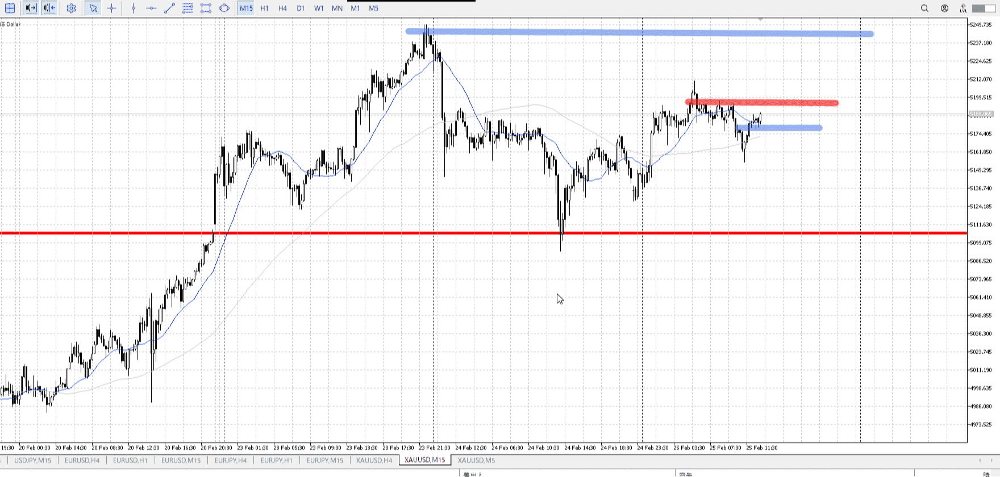
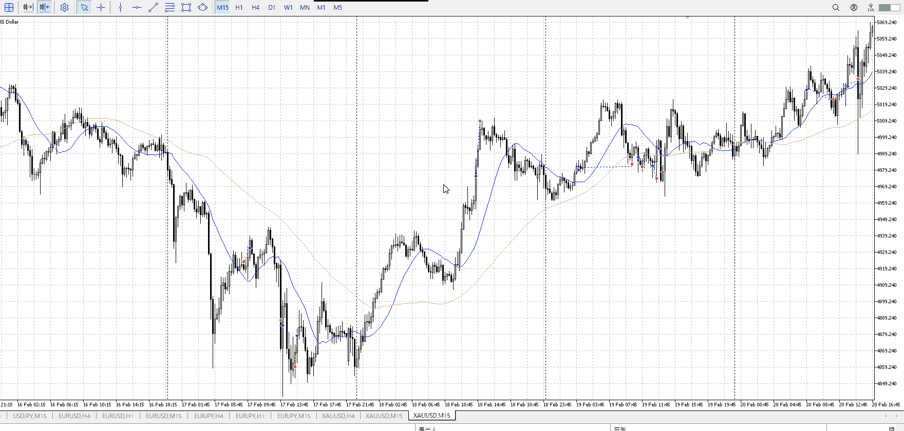
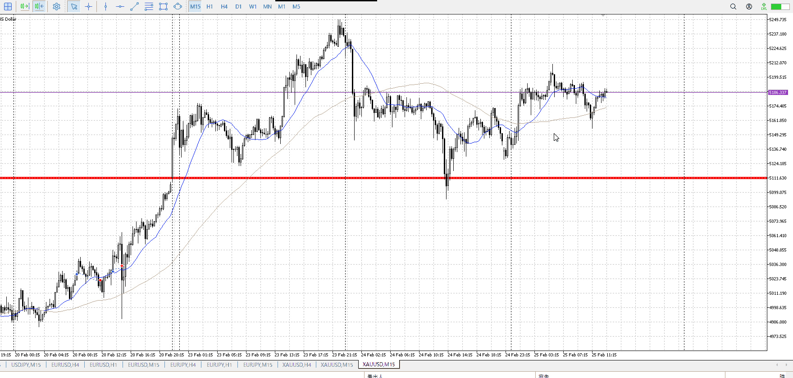
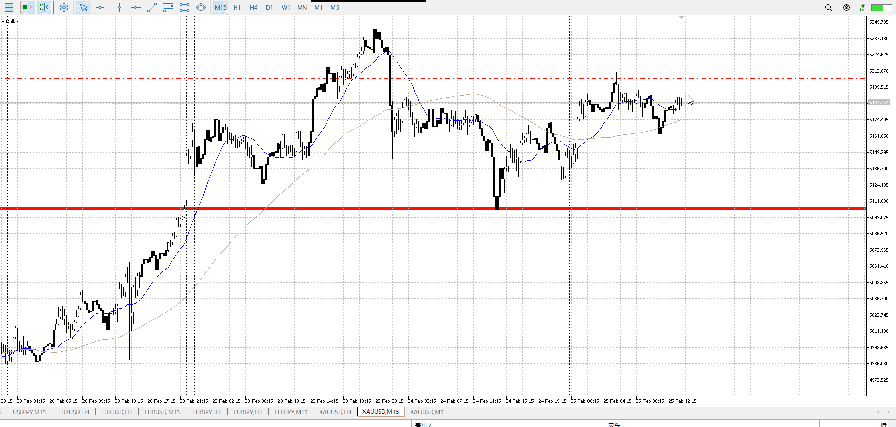

<画像>

下降1h15bar、上昇20bar
15mレンジ上抜き、下髭

15m上昇25bar、下降22bar
比率、2倍で半分

5mレンジ下抜き上昇
と言いたいが、抜いてる場所を考慮しようとすると1mになるので
5mレンジ上を抜くまであまり油断できない

といっても5mでこのレンジが意識されてるかはよくわからん
抜いてる部分以外は揃ってるからある程度は？

![[../../images/len20260225T095337 2026-02-25 22.05.33.excalidraw]]

こうを待っても遅くないのでは？
いやでも、それを待つほど横幅とってないわけじゃなくね？




それを待つ場合、TPSLこんなんなりそう。


15mは項で合って、上を向いてない。
まだ調整途中として処理する段階のはず。



前を参照する。
この下止まりは1hの抜き止め、つまり下振り否定。
今回も確かに15ｍを下抜き4h天井止めはしてる、が更新しまくってた落ちを止めたのとはわけが違う



そもそも15mで買いたいかここ？
むしろレンジ下で戻り売りされそうで怖いぞ。

![[../../images/len20260225T095337 2026-02-25 22.05.33.excalidraw]]

やはりこれを待つべきなのか。
赤線ポイントの時点で買いを考えたほうがよさそうではあるけど。

15mの押し目買いを待ってたんじゃないのか？
そのために5mのレンジブレイク押し目を待ってるが。

そも1hで元々買われたにしては遅くね？
下降に同じく横幅かけて上昇7分目程度、これは1hの調整がまた始まりそうな感じがあるが。
上昇に対して下降が薄く、押し目買いがかかるならわかる範囲
ただこれを持ち出せる以上、やっぱりレンジへの押し目を待ちたい。



15mとしても上昇が遅かったかもしれない。下髭について買った。
下降5barに対し上昇10bar。

明確なレンジ抜けでない、早いと思う
また15mも上髭が揃い始めているという不安
まーた期待感と5mの髭につられてら、明確に何を待つとか決めてなかったっけ
それまで買わないを明確に宣言してない、5mでレンジブレイクして押してくるまで明確に何もしないと宣言するべき


だよねえ


TPSL
```meta-bind
INPUT[toggle:TPSL]
```

Height
```meta-bind
INPUT[toggle:Height]
```
Width
```meta-bind
INPUT[toggle:Width]
```
Direction
```meta-bind
INPUT[toggle:Direction]
```
Incline_Ratio
```meta-bind
INPUT[toggle:Incline_Ratio]
```

Env_Wave
```meta-bind
INPUT[toggle:Env_Wave]
```
ObEnv_Range_Break
```meta-bind
INPUT[toggle:ObEnv_Range_Break]
```
HTF_about_candle
```meta-bind
INPUT[toggle:HTF_about_candle]
```
Entry_Candle_Wicks
```meta-bind
INPUT[toggle:Entry_Candle_Wicks]
```


比較対象


環境足波
調整終わりor推進乗り

環境足明確抜け

ローソクに対する上位足根拠

エントリー足髭