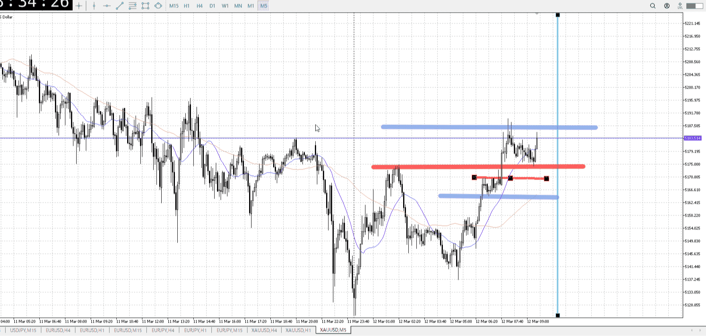

<画像>
環境15mに乗っかる5m
なので5mAは最低横に向いてないと

TPSL
```meta-bind
INPUT[toggle:TPSL]
```

Height
```meta-bind
INPUT[toggle:Height]
```
Width
```meta-bind
INPUT[toggle:Width]
```
Direction
```meta-bind
INPUT[toggle:Direction]
```
Incline_Ratio
```meta-bind
INPUT[toggle:Incline_Ratio]
```

Env_Wave
```meta-bind
INPUT[toggle:Env_Wave]
```
ObEnv_Range_Break
```meta-bind
INPUT[toggle:ObEnv_Range_Break]
```
HTF_about_candle
```meta-bind
INPUT[toggle:HTF_about_candle]
```
Entry_Candle_Wicks
```meta-bind
INPUT[toggle:Entry_Candle_Wicks]
```

ルールに沿っているか

比較対象


環境足波
調整終わりor推進乗り

環境足明確抜け

ローソクに対する上位足根拠

エントリー足髭