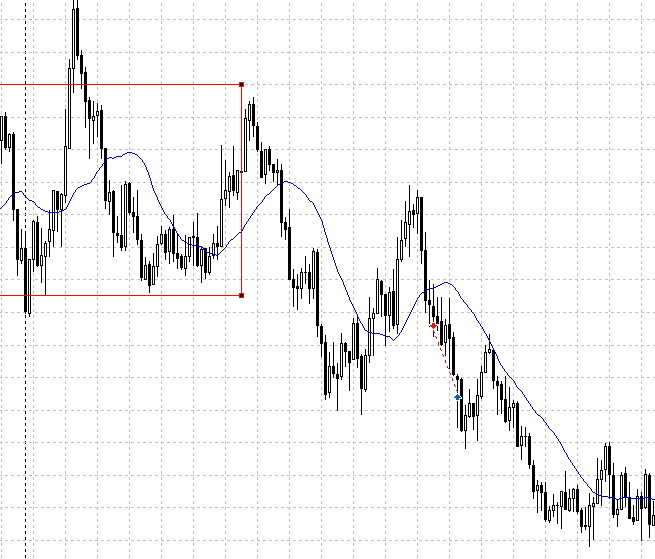
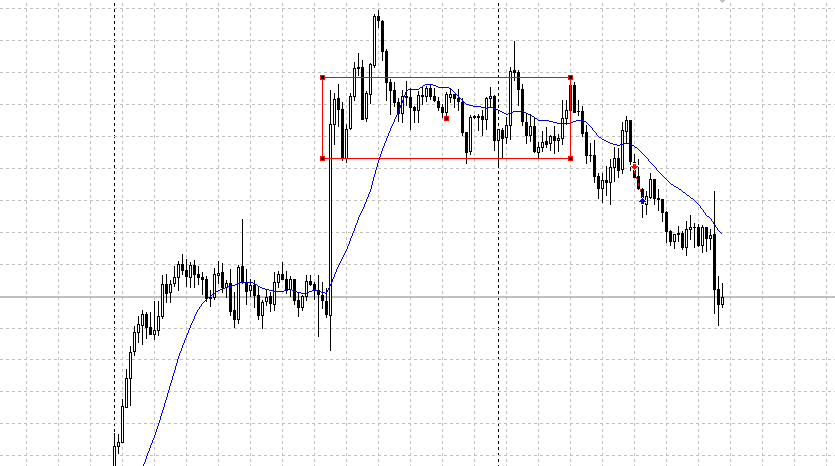
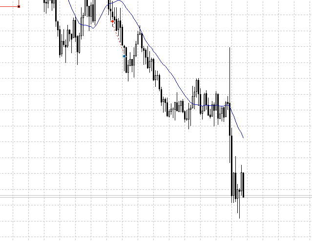
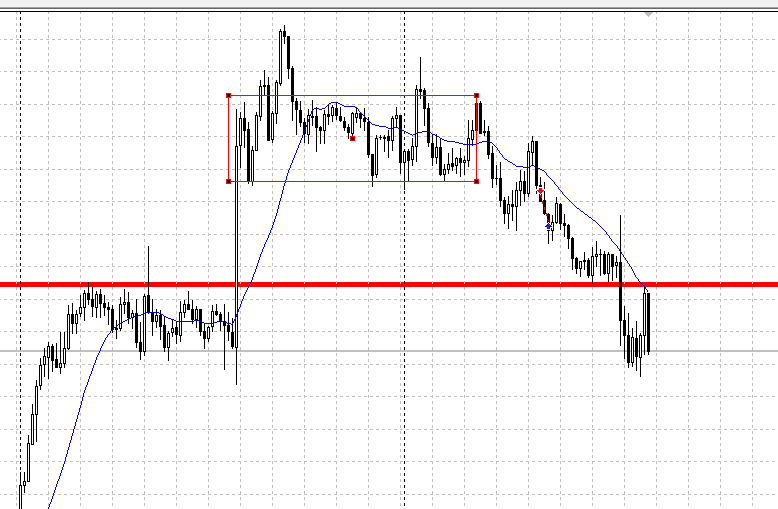

- USDJPY
    - 4Hd,1Hu
    - 上向きとはいえ、そろそろ4Hで一回止まる
    - 今レンジなので、そこに気を付けて買いか売りか決める
    - パッと見た感じでは下に複数回ぶつかっており、大変落ちそう
- EURUSD
    - 4Hd、1Hu
    - ujと同じくそろそろ壁が迫ってる
    - 今はレンジではなさそうなので、4Hの壁にぶつかってレンジが想定シナリオ
    - 4Hで早めに上がってきてるのが気がかり、上昇力は高い？
- EURJPY
    - 4Hd、1Hu
    - 4Hの50%、一度は止まるはず
    - 下に張り付くような動きをしてるので、そろそろ落ちるか

JPY相場っぽい
euがもう少し上がりそうなので、売りやすいのはujか

uj逆行中
どっかでもたついて戻ったら買える？

月頭と月末に雇用統計とFOMC
月半ばにCPI

じっくり見て、1H平均もおいつき売れるようになったと確信
上勢いが強いと思ったので終わり
ただもう一回売れたと思う

15m、昨日のもみ合いのところまできた

下髭が出た**ものの、上髭がそれ以上にあり実態が突き抜け下ローソク**
つまり売れる

**比率も加味**、ローソクを読んで実際それが**どちらに偏っているか**を判断する

また、15m確定でも入れる
これはトレンドの頂点ではあるが、左のレンジの高値を抜けている
ここの損切を巻き込める、なので売れる

巻き込めるから、伸びるから
だから入る
現在の方向は大切だが、**方向に行ったとき、決まった時どこで引っかかるか**はちゃんと確認する

なのでこれは売れるよね……
これ以上に無く入りやすい抜けがあるなら、当然戻りもある。

もう一つ小さい時間足では、平均がついてこなくても取引できる
上げれば上げるほど安定するが耐えも長い