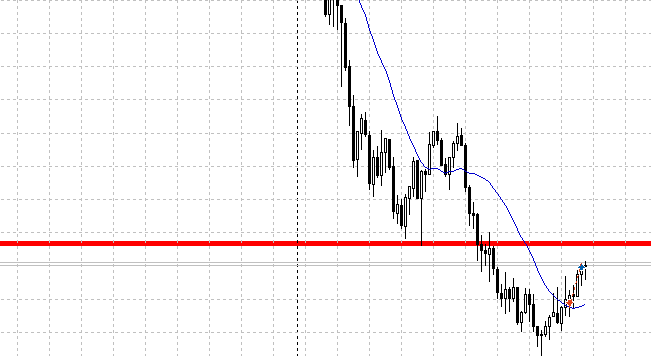
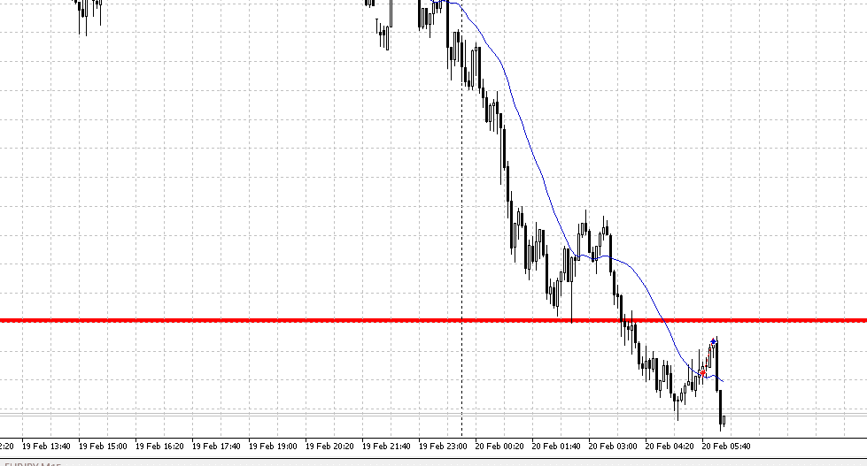
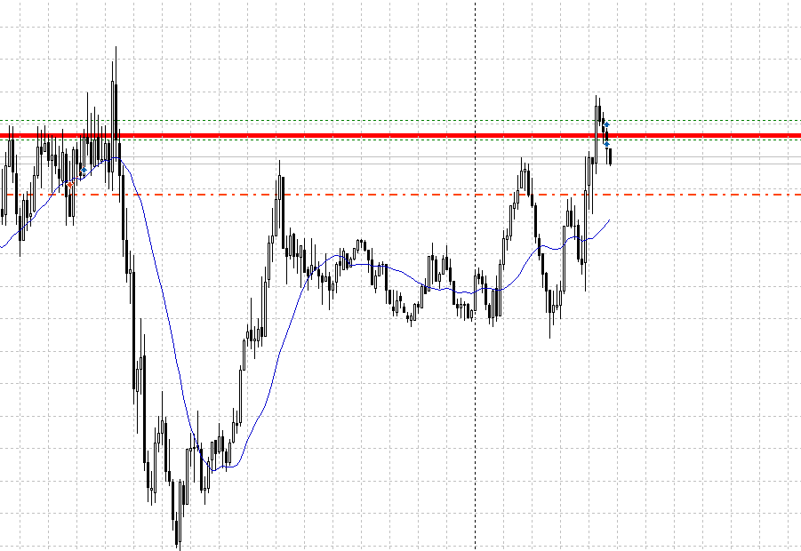
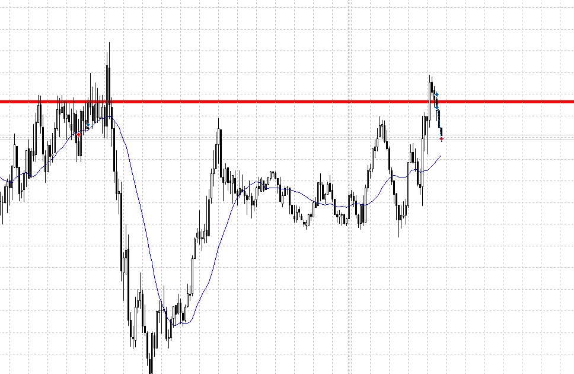
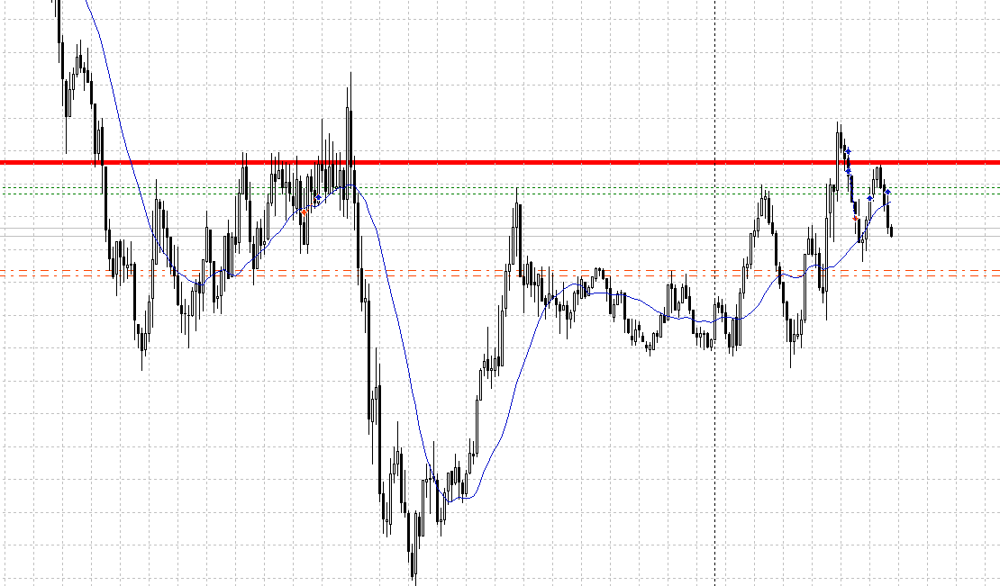
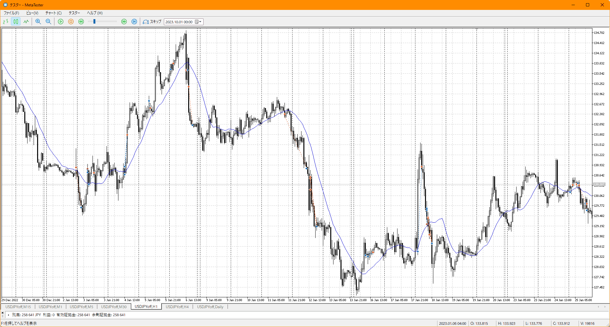
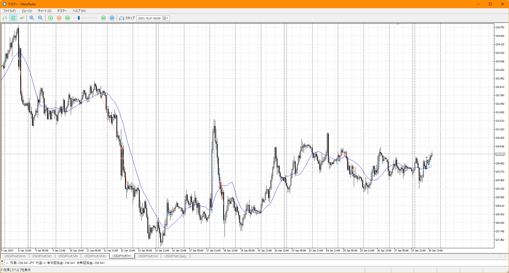

負けパターン
- 周りにつられて焦って取引
    - まずは分析、それが無ければ入ることは出来ない
- 一度止めた後、入りなおせずに落ちていく
    - 辞めた後も注視する、一日の中に必ず一つは入れる場所はある
- 「分析」ではなく「形」「感覚」でスキップする
    - **意味を考える**

- USDJPY
    - dd
    - 完全d、戻ってきたら売る
    - とどまってきたが、上はまだ追いついてない
    - 
    - 止まり気味のところで上髭が入った
    - けど早すぎ、**直前で下がりどまり**っぽいのが出てるのでこれを考慮すべき
    - 切る場所も変、ここには何もない
        - というかもともと入ろうとした高さじゃんここ
    - **大きいなと感じるなら、そもそもそこは入る場所か**どうか考える
    - 
    - 直前は、下がりどまりするかと思いきやしっかりそれを陰線が超えていった
    - 今回は特に大きな陰線もないポイント、下がりどまりを止められるほどの力はない
    - それを止めるなら、元々売ろうと考えてたこっちのポイント
    - 早めに落ちていくにしても上がることは上がるはず、**エントリーから逆に行くならどこで止まり、抜けるまでか**を元に損切を決める
- EURUSD
    - uu
    - 上に跳ね返った、レンジを上抜けたら買う
    - 
    - 上抜けたので買った
    - 左高値に止められている感じもあるが、どうか
    - 
    - 切られた
    - まだ上は行けそうなので注視
    - 
    - 上がってきたので再度
    - **4H上髭が確定**
    - 直近高値より下で折れた、弱い
    - **朝にたくさん入るのは対象の奴だけ、他は違う**
    - 17時まではいつも月曜警戒でいいのでは？
    - そもそも、5mを見てるせいでは
    - 15mで見ると小さい、なので失敗したと考えられる
    - あくまで**主人公は15m**、その最後の最後で必要なのが5m
- EURJPY
    - dd
    - ujと同じ、戻ってきたら売る

シグナルを待つ

