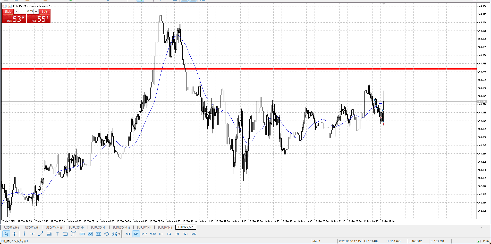
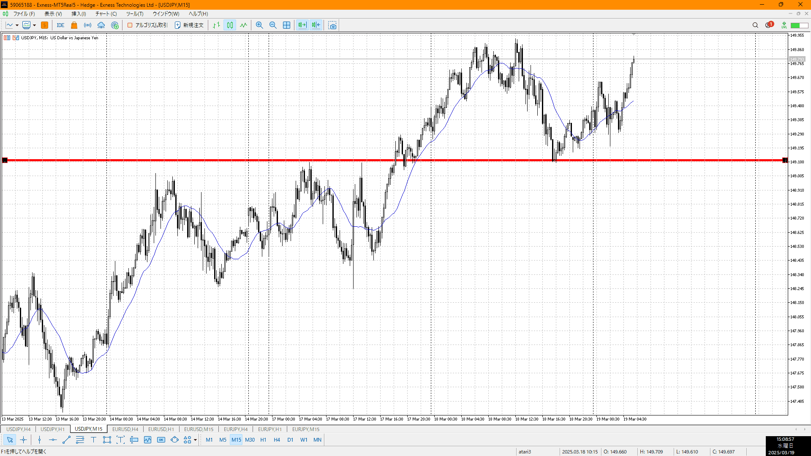

分析は使ってこそ意味がある

- USDJPY
    - duu
    - 1h高値で跳ね返り、ここは早朝なので見るのは厳しい
    - その後切り上がりなので、上に行くことは行きそう
    - ただだらだらしてるのでレンジ待ち
    - 通常買い、速攻売り
    - 5m初動が一番だが、15m確定でも買えた
    - **怪しい挙動と、出来ることを考えろ**、いつでも。
    - またあそこに行きたくない
- EURUSD
    - uuu
    - 昨日で一回安値直前、そこから帰ってきて切り下がりのかなり売り
    - 5mだと割ってる、少し売れるか
    - ちょっとRR悪いので見送り
    - 初動でギリというところ
- EURJPY
    - uuu
    - 4h高値付近、レンジ中
    - いつも通りレンジブレイクと戻し待ち

5m買狙い
最初の買いあたりが15m下髭だったり、1hレンジ前（戻し）だったりで上に行く要素はあった
でもやっぱ遅い

次のはまだ15m下がり切ってない状態で止まったので
ただ損切がわけわからん場所だった、せめて15mの下限くらいは含めろ

今どの時間足で入ってるのか、**どこまで取るつもりか**
**今どの時間足で入ってるのかどこまで取るつもりか**
今どの時間足で入ってるのかどこまで取るつもりか

入る時間足が明確なら損切もそれ相応になる
**1つの時間足を元に決めた損切利確**で、RRを比較検討

買いを意識してるなら、この上昇の根元あたりで買えた
1h押し戻しでもあり

- uj
    - 押し戻しから上昇中、レンジ待ち
- eu
    - レンジから緩やか下降中、しばらく手出しできない
- ej
    - レンジ抜けな物の15mレベル、個々では何もできないので次レンジ待ち
    - レンジを抜いてるので売れたはず

**待ちなら次の重要ブロックを明確化しておく**
何処で何を待ってるの今

1つの時間足を元に決めた損切利確で、RR検討
次の重要ブロックの明確化
場を抜けてないならまだある[2025-03-14](./2025-03-14.md)

卑下じゃなく、重要性の明文化
これで金を稼いでる、金

4hとコンボする
大きな目線の切り下げ切り上げは超大事、環境認識の補強
相関含め完璧なら、
