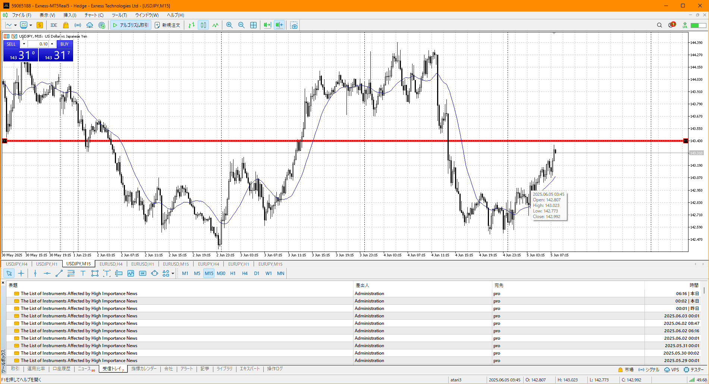
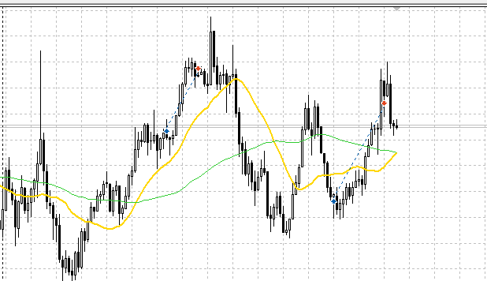
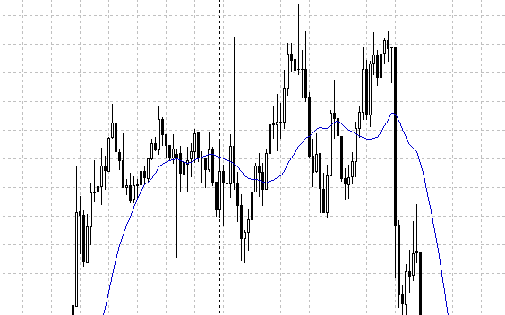

- USDJPY
- EURUSD
- EURJPY

凄く落ちたとはいえ、その二倍くらいの時間はかけて支払っている
その上切り上げ、一応1hは上
加えて直近が上張り付き

買える部分が多いので、多くの稼ぎが期待できる

買える、次は

![[../../images/2025-06-05 2025-06-05 18.09.38.excalidraw]]

![[../../images/2025-06-05 2025-06-05 19.58.03.excalidraw]]

1. レンジからの上滞留買い
上髭取っての降下で下がり切らず、二本落ちずに滞留
ここで買い
利確は左高値(上髭よりも左にこの高さの高値がある)

2. レンジ戻し二回目から買い
どこまで落ちるかを1回目で測り、二回目でひきつけて下髭出たとこで買い
利確は左高値

