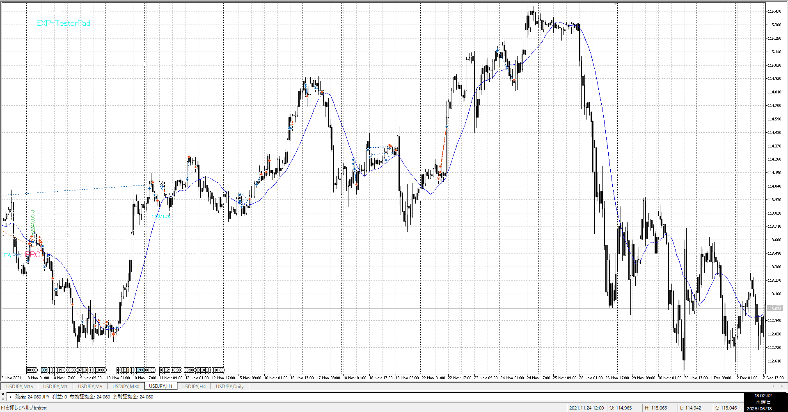
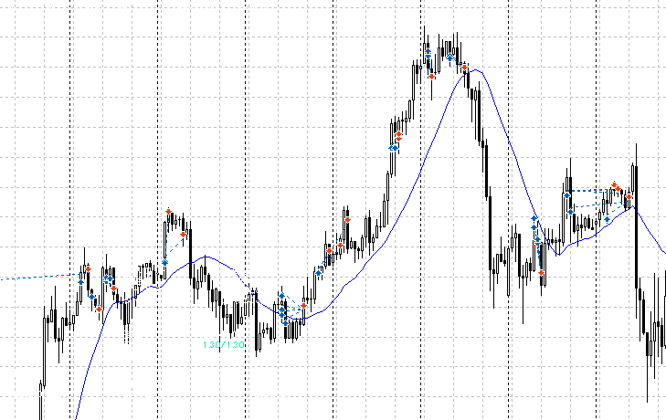
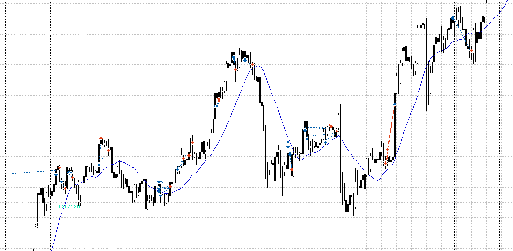
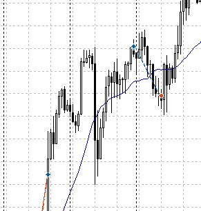

![[../../images/2025-06-18 2025-06-18 17.55.29.excalidraw]]

急下降に対して思ったより落ちないから買う、というのは何度も試さないといけない
急下降、特にレンジ上限（いつもは跳ね返る）を一本で突き抜くようなら、買いは一度止める

![[../../images/2025-06-18 2025-06-18 18.23.04.excalidraw]]

4hで下髭、下に完全に行ったわけではない
なので売りは出来ない

![[../../images/2025-06-18 2025-06-18 18.10.59.excalidraw]]

急降下はどうあっても懸念、レンジがあっても買えるわけでない
買い幅としても急降下の上までしか買えない
買い位置としてもトレンドの3波途中買いみたいになるのでだめ