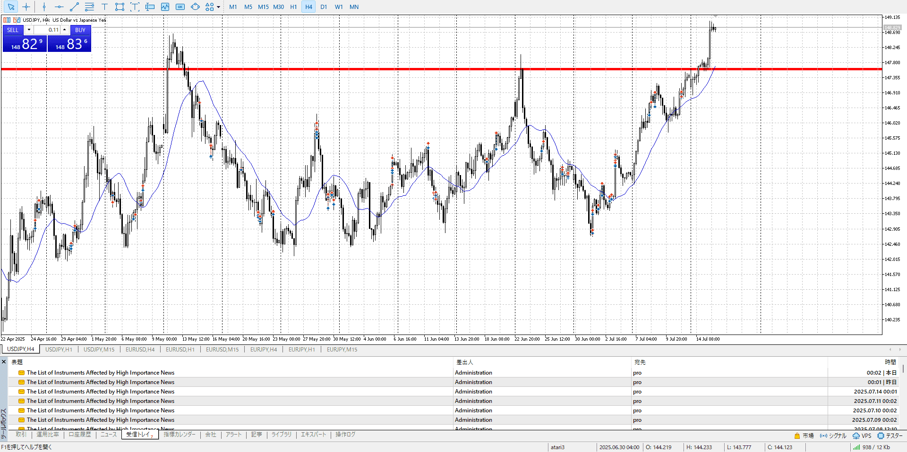
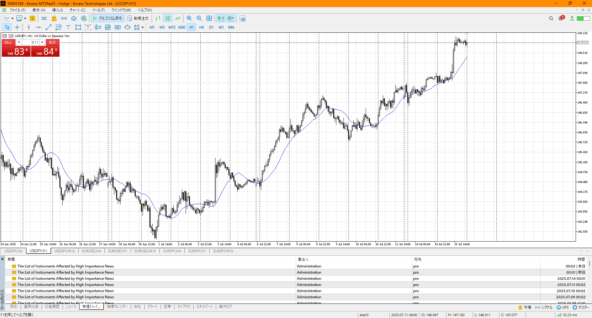
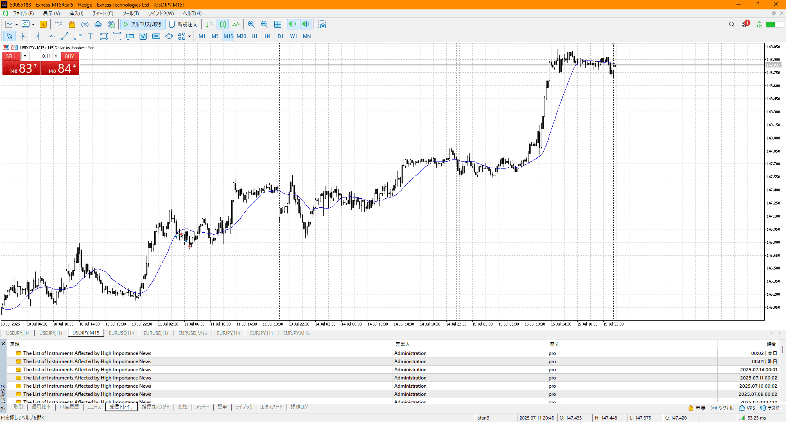
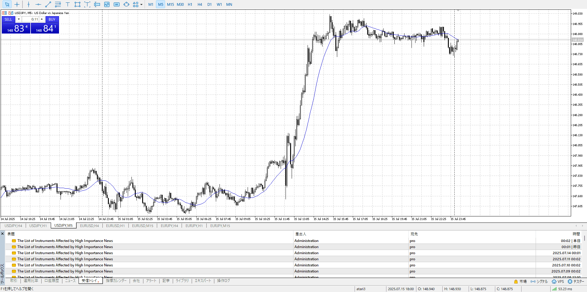
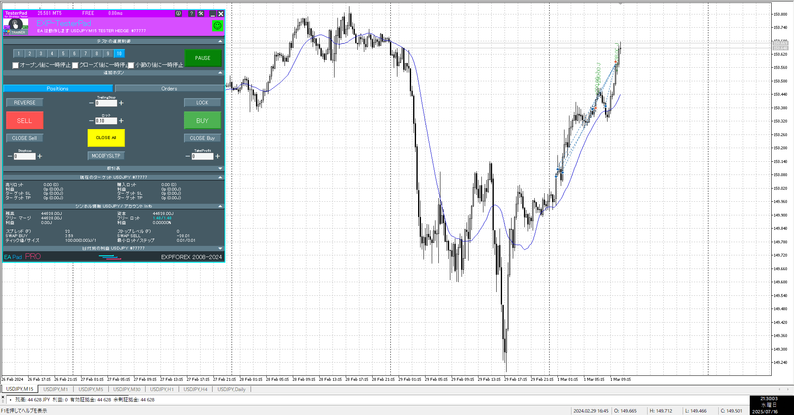

- USDJPY
- EURUSD
- EURJPY

CPI
警戒して下触れでなく上抜きで確実+最初だけ狙った、というと聞こえはいい。

けど上抜きはつまり二波の売り場であってなんでもない場所なので、この発想自体が間違い
そもそも5mまで確認したんだから、これの下髭確定くらいで入ればいい
必要なのはこの上抜きで上が確定できたと考え、そこから押し目を待つ姿勢

最初だけというのも微妙
指標でも普段と変わりないので、普通に押し目待ちが出来る
だから二度目の下落から下髭で入れる
2回底を叩いて落ちないことを確認+早めの長下髭により上の力が強いことを示すパターン

よって、上抜きで上確定 -> 押し目待ち + 底叩き -> 長下髭で上の力が強いことを確認 -> エントリー、が一番楽

最速下触れ5m買いは……ちょっとむずい
落ちたナイフ

1hが変な形で躊躇して一旦様子見というのはあるが、**それなら中を見て判断することになる**、短期買い
大局的にも5m直近的にも上
おまけに1h確定は入った後なので、持ちながらどっちに行くのか見ればいい
それでも待つなら上髭をレンジ上限と見て上抜き

指標の効力より、今どっち向きなのか
買うことは15mでも5mでも決まってる、なので55分買い入り
ちょっと深そうな感じだが問題ない範囲内

買いとして決めてるなら、下抜くまで買い

![[../../images/2025-07-16 2025-07-16 13.34.16.excalidraw]]

![[../../images/2025-07-16 2025-07-16 13.40.31.excalidraw]]![[../../images/2025-07-16 2025-07-16 13.42.43.excalidraw]]

![[../../images/2025-07-16 2025-07-16 21.38.06.excalidraw]]

方向を決定し、レンジ待ち、明確な場所でエントリーする形
その後も弱い抵抗で切らず追加したり、下抜いてないから切らなかったり