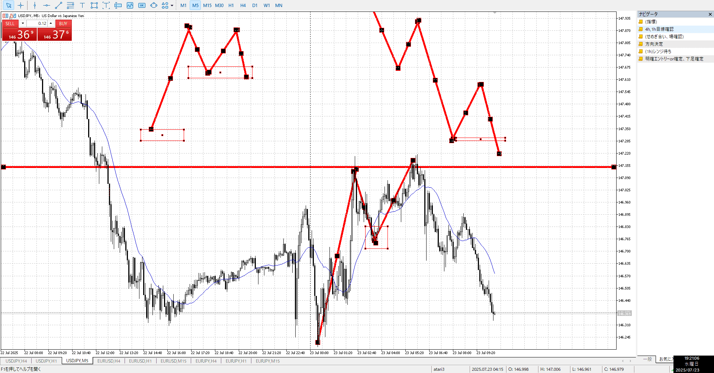
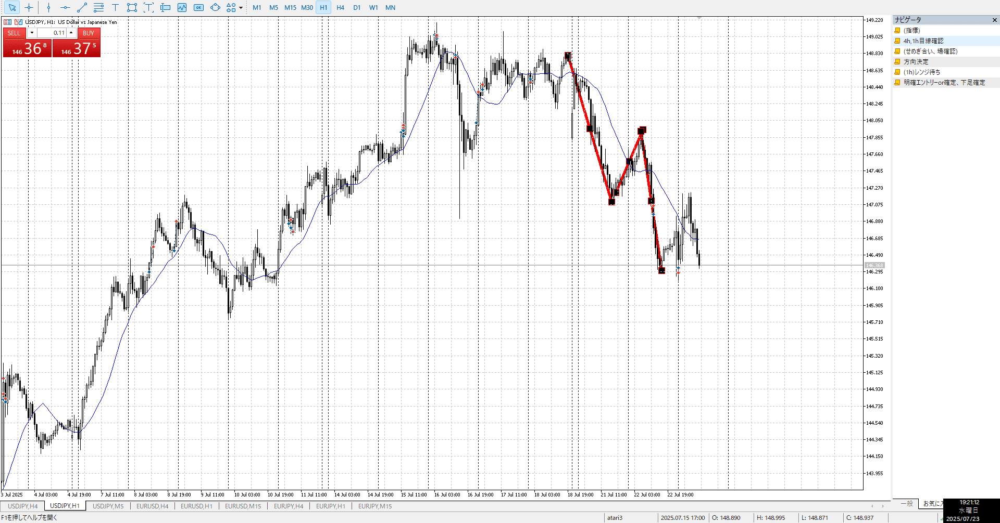

- USDJPY
- EURUSD
- EURJP

![[../../images/2025-07-23 2025-07-23 19.21.31.excalidraw]]
![[../../images/2025-07-23 2025-07-23 19.22.12.excalidraw]]

15mで気になる速さの足があるが、**目線には関係ない**
勢いはあるが実際に目線で上がりなおしたのは□の位置、ここでもう一回上がって3波になるかと思いきや、1hで止められ下へ
そこから上がり切らず落ちていく、ここで売れる（下抜きなど）

気にするのはそうだが、エントリー時ではない。エントリーに必要なのは目線の形状をもとに分析して、決めた方向で取引すること
（縦軸あるから横軸待はあり）

利確には気にする

また、下すぎる
1hだとほぼ波の始まり部分、良く負けてる部分
なのでもっと上での形を考える