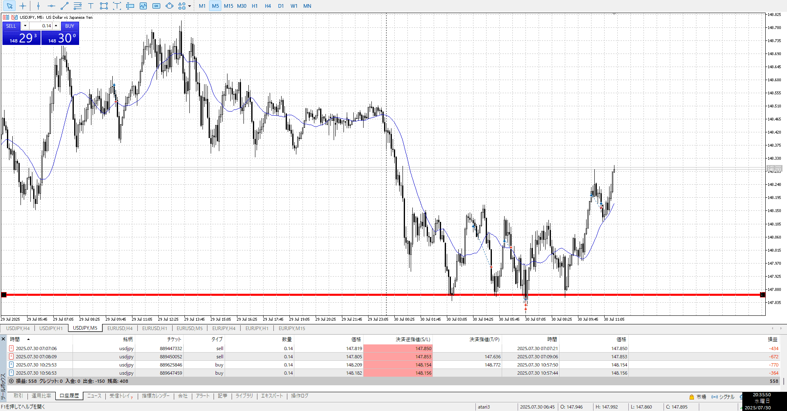

- [x] 指標
- [ ] 4h,1h目線確認
- [ ] 方向決定
- [ ] せめぎ合い、場確認
- [ ] (1h)レンジ待ち
- [ ] 明確エントリー/確定、下足確定

今日の夜中にFOMCがあるので、動く気がしない
4h頭、1h上昇
買いは間違いない、1hもレンジになりつつあるのでこれが抜けたりを狙う

合わせすぎ
適当すぎ

そもそも指標前に不用意にやりすぎ、指標前はもっと慎重に
レンジになるのも指標前だし

