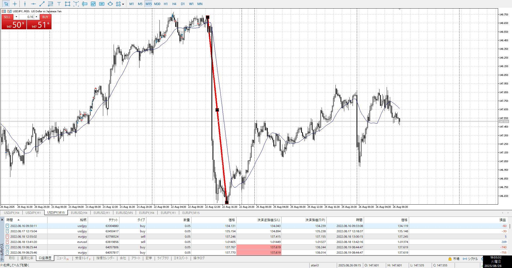

- [x] 指標
- [x] 4h,1h目線確認
- [ ] 方向決定
- [ ] せめぎ合い、場確認
    - [ ] 両方の視点をもつ
- [ ] 目立つ場所
    - [ ] 切り上げ下げ、大きな動き
- [ ] (1h)レンジ待ち
- [ ] 明確エントリー/確定、下足確定

レンジにいる
開幕下がった分を同じ時間かけて上がった
急降下の半値は抜けてない、下有利

買うならせめて半値は抜けてほしい、もしくは下振ってから上抜き
売るならレンジ戻りでいいが
大きいレンジは抜けてないので、そのうち買いに鳴ってもおかしくないな

上を何度も止められてる
下は切り上げ100％戻されてる

買うなら上を抜いたとき
売るなら普通に、目線は変わってないのでいつも通りに

